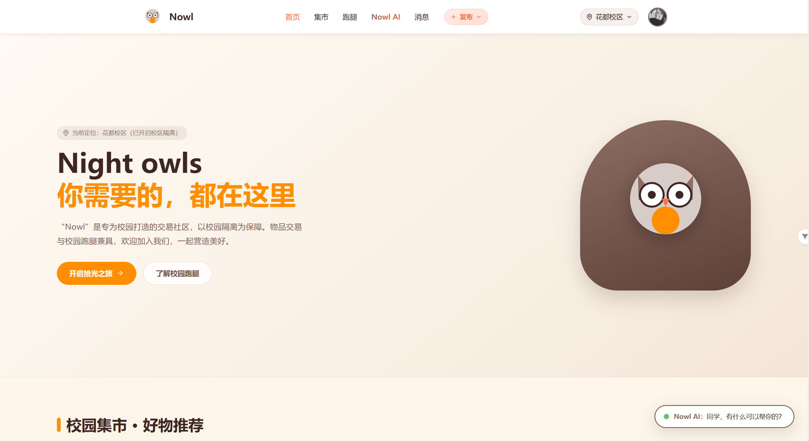
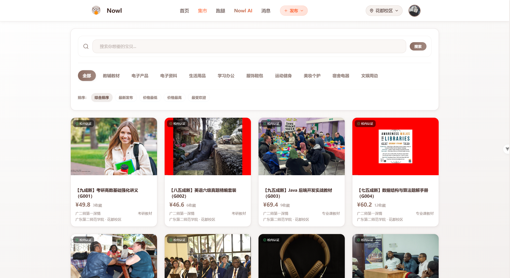
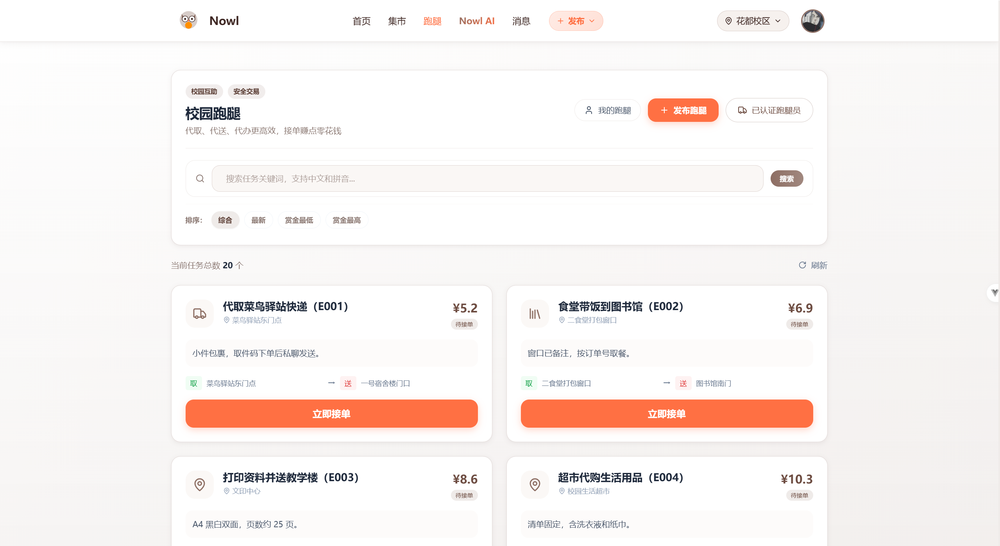
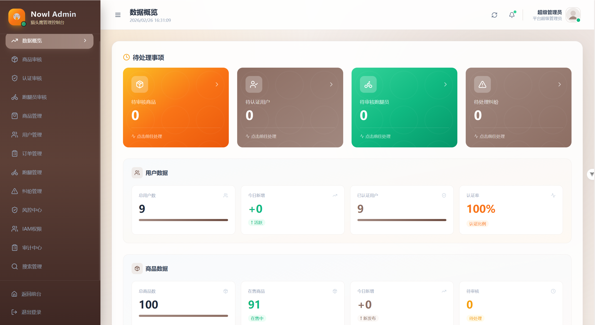
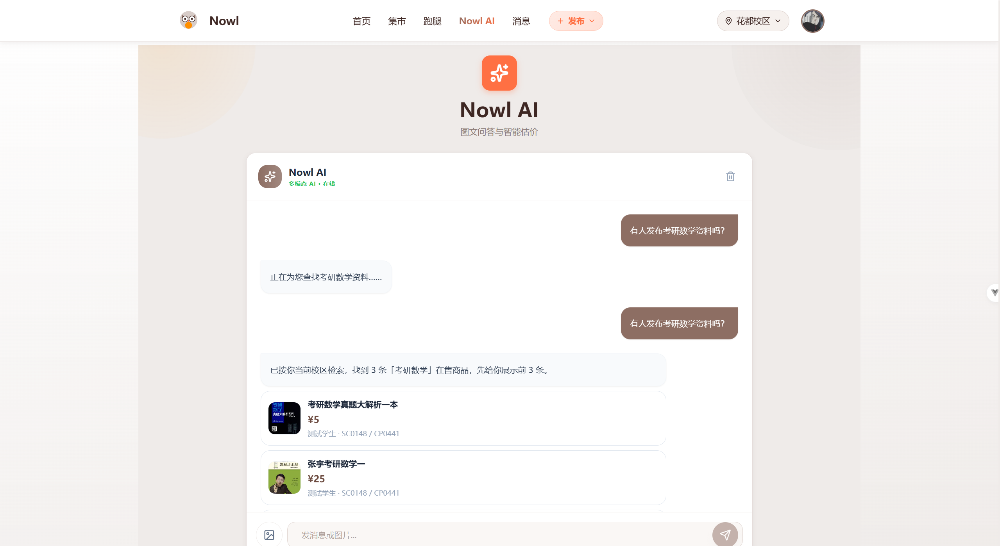

# Nowl

Nowl = Night owl，寓意“夜猫子”，这是一个商品与跑腿聚合的校园平台，将校园两大热门交易场景结合，并融入了AI Chat，你可以跟ta聊天或者让ta给他推荐在售的商品。除了前台，项目也有完整的后台管理系统，采用IAM权限控制，支持超管、学校级/校区级管理员，又或者是其他运营管理员。项目有风险控制体系与搜索推荐体系，虽然轻量，但却构建起了一个功能完善的校园平台，在这里你可以购物、可以跑腿、可以聊天，拉黑/关注用户，购买商品不满意亦可发起纠纷处理，管理员会继续处理，扣款/扣除积分/甚至直接封禁违规账号。
如果你也需要这样的项目，用于学习、毕业设计，那么随便你，我把项目放在了这里。记得点个star哦

- 前端：Vue 3 + TypeScript + Vite + Pinia
- 后端：Spring Boot 3 多模块（`web/security/core/admin/search/recommend/ai/gateway`）
- 中间件（按需启用）：MySQL、Redis、RocketMQ、Elasticsearch、XXL-JOB


## 界面预览

<p>
  
  
</p>
<p>
  
  
</p>
<p>
  
</p>

## 功能概览

- 校园数据隔离：按学校/校区约束数据范围
- 商品链路：发布 -> 风控 -> AI 审核 ->（必要时）后台人工复核 -> 上架
- 订单链路：下单（防超卖锁）-> 托管资金阶段 -> 退款/纠纷互斥 -> 结算或结束态
- 跑腿链路：发布/审核 -> 接单互斥 -> 履约 ->（延迟）自动确认
- 搜索：Elasticsearch 检索 + 高亮，Redis 热搜/历史
- 推荐：离线相似度 + 用户画像 + 在线融合兜底
- 风控：行为管控、黑白名单、高级信号、阈值/关键词规则、风控工单
- 通知：落库 + WebSocket 推送，后端计算 `bizType` 供前端跳转

## 仓库结构

```text
Nowl/
├── Nowl-front/     # Vue3 前端
├── Nowl-backend/   # Spring Boot 多模块后端
├── sql/            # 数据库初始化脚本（推荐执行这里）
└── docs/           # 设计说明书 / 中间件部署文档
```

## 快速开始（本地）

### 1) 环境要求

- JDK 17+
- Maven 3.9+
- Node.js 18+（建议）与 npm

中间件最低要求：

- MySQL 8+
- Redis 6+

可选（不启用则对应功能不可用或降级）：

- RocketMQ（审核异步化、索引同步、延迟任务）
- Elasticsearch（搜索与高亮）
- XXL-JOB（推荐离线任务）

### 2) 初始化数据库

推荐使用仓库根目录脚本：`sql/nowl_init.sql`（包含建库建表 + 角色/权限/风控规则 + 分类/学校种子数据）。

```bash
mysql -u root -p < sql/nowl_init.sql
```

### 3) 配置环境变量

参考根目录 `.env.example`（不要提交真实密钥）。注意：后端是通过“系统环境变量/IDE 运行配置”读取的，`.env` 文件不会被 Spring Boot 自动加载。

最少需要配置：

- `DB_URL` `DB_USERNAME` `DB_PASSWORD`
- `REDIS_HOST` `REDIS_PORT`（如有密码再配 `REDIS_PASSWORD`）
- `JWT_SECRET`（可以先用示例值，生产环境务必更换）

可选配置：

- AI：`OPENAI_API_KEY` `OPENAI_BASE_URL` `OPENAI_MODEL`
- COS：`COS_SECRET_ID` `COS_SECRET_KEY` `COS_REGION` `COS_BUCKET_NAME` `COS_BASE_URL`
- MQ：`ROCKETMQ_NAME_SERVER`
- ES：`ES_HOST`
- XXL：`XXL_JOB_ADMIN_ADDRESSES`
- 短信：`SMS_ENABLED` `SMS_SPUG_URL`

### 4) 启动后端（业务服务）

后端入口模块是 `unimarket-web`，默认端口 `8080`。

```bash
cd Nowl-backend
mvn -q -DskipTests -pl unimarket-web -am spring-boot:run
```

### 5) 启动网关（推荐）

前端默认把 `/api` 代理到网关（端口 `8090`），网关再转发到后端 `8080`。

```bash
cd Nowl-backend
mvn -q -DskipTests -pl unimarket-gateway -am spring-boot:run
```

### 6) 启动前端

```bash
cd Nowl-front
npm install
npm run dev
```

开发环境默认：

- 前端：`http://localhost:5173`
- 网关：`http://localhost:8090`
- 后端：`http://localhost:8080`

## 管理员权限（可选）

初始化脚本会写入角色与权限点，但不会创建默认管理员账号。你可以先在前端注册账号，然后在数据库手动绑定角色与管理范围。

示例：把 `user_id=123` 绑定为超级管理员并赋予全范围（仅示例，自行替换 user_id）：

```sql
INSERT INTO iam_user_role(user_id, role_id, status)
SELECT 123, role_id, 1
FROM iam_role
WHERE role_code = 'SUPER_ADMIN'
ON DUPLICATE KEY UPDATE status = 1;

INSERT INTO iam_admin_scope_binding(user_id, scope_type, status)
VALUES (123, 'ALL', 1);
```

## 文档

- 设计说明书：`docs/Nowl系统设计说明书.md`
- 中间件部署文档：`docs/中间件部署文档.md`

## License

MIT License，见 `LICENSE`。
