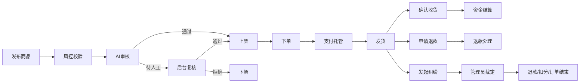
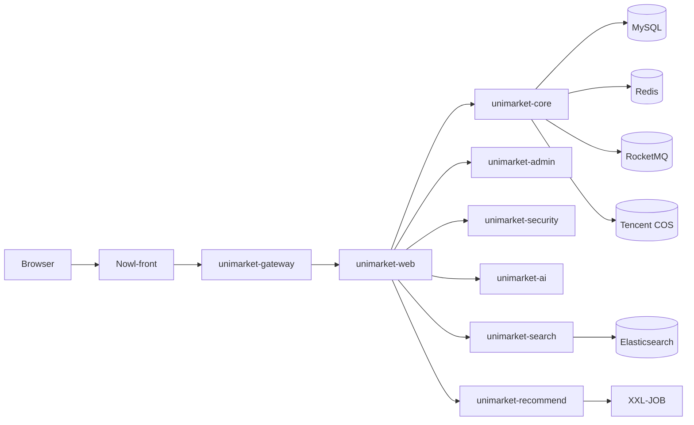
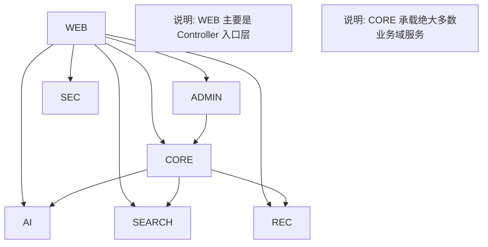
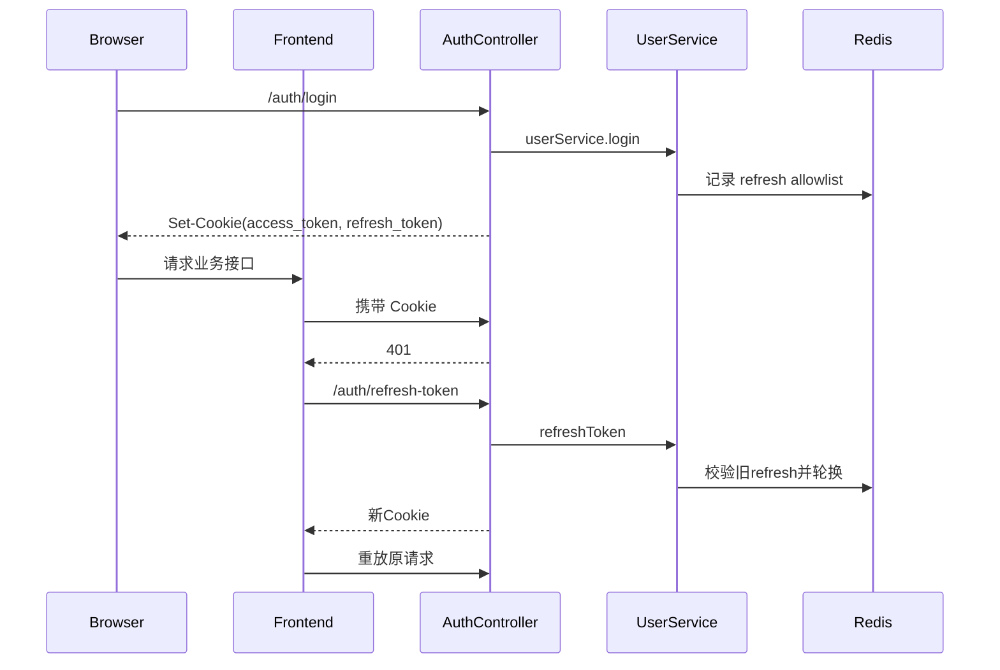
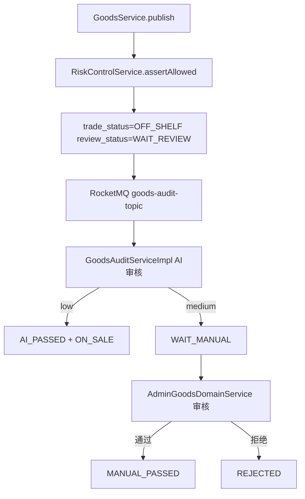

# Nowl 系统设计说明书

> 版本：v1.2
>
> 更新日期：2026-03-03
>
> 适用仓库：Nowl-front、Nowl-backend

---

## 1. 课题与设计理念

课题名称：基于 Spring Boot + Vue3 的校园交易与跑腿平台。

课题简介：围绕校园二手交易高频问题（身份可信不足、违规内容难监管、信息匹配效率低、交易纠纷难处理）构建一套可审核、可追踪、可仲裁、可扩展的业务系统。项目并非“单一买卖页面”，而是一个包含交易、跑腿、风控、权限、搜索、推荐、AI 审核与管理后台治理的完整后端系统。

本系统的设计理念：

1. 校园数据隔离优先：所有交易数据按学校/校区做范围约束。
2. 资金安全优先：围绕“托管资金阶段”设计退款与纠纷互斥规则。
3. 可治理优先：风控、审核、审计、后台操作都可追踪可回放。
4. 可演进优先：模块化拆分，支持后续独立扩容（搜索、推荐、网关等）。

---

## 2. 需求分析

### 2.1 角色与边界

- 普通用户：注册、认证、发布商品/跑腿、下单、退款、纠纷、消息、评价。
- 管理员：审核商品/跑腿/实名、处理纠纷、发布系统通知、查看审计。
- 风控运营：配置风控规则、行为管控、黑白名单、处理风险工单。
- 平台系统：AI 审核、索引同步、推荐计算、定时任务、网关审计。

### 2.2 核心流程闭环



### 2.3 非功能目标

- 并发安全：订单、跑腿、纠纷、审核操作均加分布式锁。
- 幂等保障：重复请求不会重复扣款/重复退款/重复改状态。
- 可观测性：网关 traceId、操作审计、风险事件、工单链路齐全。
- 可运维性：搜索索引支持重建，全量同步和离线任务可重跑。

---

## 3. 系统架构设计

### 3.1 总体架构



### 3.2 后端模块关系



---

## 4. 模块详细介绍

本章按“模块定位 -> 包结构 -> 关键类 -> 代码样例”介绍。目标是让不熟悉项目的人，直接看完就能定位代码入口。

### 4.0 模块总览（先看这一节）

```text
unimarket-web        对外 Controller 入口 + application.yml
unimarket-security   鉴权、CSRF、用户上下文
unimarket-core       交易/订单/跑腿/纠纷/风控/AI编排核心业务
unimarket-admin      审核、纠纷裁定、风控配置、审计后台域
unimarket-ai         模型能力层（审核/聊天/估价）
unimarket-search     ES 检索、排序、高亮、热搜、索引同步
unimarket-recommend  推荐算法、行为采集、离线任务
unimarket-gateway    路由、限流、审计、trace
Nowl-front           前端页面、路由、状态管理、消息跳转
```

阅读建议：

1. 先看 `unimarket-web` 明确接口入口。
2. 再看 `unimarket-core` 理解业务规则和状态流转。
3. 最后按需进入 `unimarket-ai` / `unimarket-search` / `unimarket-recommend` 看专项能力。

### 4.1 `unimarket-web`（接口入口层）

模块定位：

- 只负责对外暴露 REST 接口、参数校验、权限注解、调用下层 service。
- 这个模块里几乎没有复杂业务逻辑，业务主要在 `unimarket-core` / `unimarket-admin`。

包结构（真实目录）：

```text
unimarket-web
├── src/main/java/com/unimarket/UniMarketApplication.java
├── src/main/java/com/unimarket/module
│   ├── ai/controller/AiController.java
│   ├── goods/controller/GoodsController.java
│   ├── order/controller/OrderController.java
│   ├── user/controller/AuthController.java
│   ├── user/controller/UserController.java
│   ├── dispute/controller/DisputeController.java
│   ├── errand/controller/ErrandController.java
│   ├── notice/controller/NoticeController.java
│   └── ...
└── src/main/resources/application.yml
```

关键类：

- `AiController`：AI 对话、历史、估价接口入口。
- `GoodsController`：商品列表、详情、发布、上下架、收藏等接口入口。
- `OrderController`：下单、支付、发货、确认收货、退款、订单纠纷入口。
- `AuthController`：登录、刷新、登出、Cookie 下发。

代码样例（入口层只做路由与编排）：

```java
// unimarket-web/src/main/java/com/unimarket/module/ai/controller/AiController.java
@PostMapping("/chat")
@PreAuthorize("@bizAuth.canMutate(authentication.principal.userId)")
public Result<AiChatResponseVO> chat(@RequestBody(required = false) @Valid AiChatRequestDTO params) {
    Long userId = UserContextHolder.getUserId();
    AiChatResponseVO response = aiAssistantService.chat(
            userId,
            UserContextHolder.getSchoolCode(),
            UserContextHolder.getCampusCode(),
            message,
            imageUrl,
            queryContext
    );
    return Result.success(response);
}
```

```yaml
# unimarket-web/src/main/resources/application.yml
spring:
  datasource:
    url: ${DB_URL:jdbc:mysql://127.0.0.1:3306/nowl}
    username: ${DB_USERNAME:root}
    password: ${DB_PASSWORD:}
  ai:
    openai:
      api-key: ${OPENAI_API_KEY:}
      base-url: ${OPENAI_BASE_URL:https://api.moonshot.cn}
```

### 4.2 `unimarket-security`（安全与上下文层）

模块定位：

- 统一鉴权、权限注解支持、CSRF 校验、用户上下文透传。

包结构：

```text
unimarket-security
├── CsrfFilter.java
├── JwtAuthenticationFilter.java
├── UserContextHolder.java
├── config/SecurityConfig.java
├── config/UserContextWebMvcConfig.java
└── util/JwtUtils.java
```

关键类：

- `SecurityConfig`：Spring Security 主配置。
- `JwtAuthenticationFilter`：JWT 鉴权。
- `CsrfFilter`：写请求 CSRF 校验。
- `UserContextHolder`：线程上下文读取 userId/schoolCode/campusCode。

代码样例：

```java
// unimarket-security/src/main/java/com/unimarket/security/CsrfFilter.java
if (!REQUESTED_WITH_VALUE.equals(requestedWith)) {
    response.setStatus(HttpServletResponse.SC_FORBIDDEN);
    response.getWriter().write("{\"code\":403,\"message\":\"CSRF校验失败：非法请求来源\"}");
    return;
}

if (hasAuthSessionCookie(request) && !isCsrfTokenValid(request)) {
    response.setStatus(HttpServletResponse.SC_FORBIDDEN);
    response.getWriter().write("{\"code\":403,\"message\":\"CSRF校验失败：Token无效\"}");
    return;
}
```

### 4.3 `unimarket-core`（核心业务域层）

模块定位：

- 平台核心业务都在这里：用户、商品、订单、跑腿、纠纷、通知、IAM、风控、AI 编排。
- 如果要查“真正的业务规则”，优先看这个模块。

包结构（按域划分）：

```text
unimarket-core/src/main/java/com/unimarket/module
├── user        (注册登录、认证、关注、信用分)
├── goods       (发布、详情、审核状态流转)
├── order       (下单、支付、发货、收货、退款)
├── dispute     (纠纷申请、补充证据、详情)
├── errand      (发布、接单、履约、结算)
├── notice      (系统通知、已读)
├── iam         (角色、权限、范围)
├── risk        (风控引擎、规则、事件、工单)
├── aiassistant (AI业务编排、历史、函数调用)
└── ...
```

关键类（示例）：

- `OrderServiceImpl`：订单状态流转与资金处理。
- `GoodsServiceImpl`：发布与审核投递。
- `ErrandServiceImpl`：跑腿并发接单与结算。
- `RiskControlServiceImpl`：风控决策主引擎。
- `AiAssistantServiceImpl`：AI 聊天业务编排（注意不是 `unimarket-ai` 的模型能力层）。

代码样例（核心规则在这里）：

```java
// unimarket-core/src/main/java/com/unimarket/module/order/service/impl/OrderServiceImpl.java
if (RefundStatus.PENDING.getCode().equals(orderInfo.getRefundStatus())) {
    throw new BusinessException("订单退款处理中，暂不可确认收货");
}
if (hasActiveOrderDispute(orderId)) {
    throw new BusinessException("订单存在进行中纠纷，暂不可确认收货");
}
```

```java
// unimarket-core/src/main/java/com/unimarket/module/aiassistant/service/impl/AiAssistantServiceImpl.java
RiskDecisionResult decision = riskControlService.evaluate(RiskContext.builder()
        .eventType(RiskEventType.AI_CHAT_SEND)
        .userId(userId)
        .subjectId(String.valueOf(userId))
        .schoolCode(schoolCode)
        .campusCode(campusCode)
        .features(features)
        .rawPayload(payload)
        .build());
if (decision.getAction() != RiskAction.ALLOW) {
    throw new BusinessException("当前 Nowl AI 对话行为触发风控策略，请稍后再试");
}
```

#### 4.3.1 商品域（goods）

入口包：

- `com.unimarket.module.goods.controller.GoodsController`（接口入口在 `unimarket-web`）
- `com.unimarket.module.goods.service.impl.GoodsServiceImpl`（商品列表/详情/发布/编辑/上下架核心）
- `com.unimarket.module.goods.listener.GoodsAuditListener`（MQ 异步审核消费）

关键点：

- 发布时先过风控，再落库为“待审核 + 未上架”，事务提交后发 MQ 审核消息。
- 详情接口对“未审核通过商品”做可见性限制：仅发布者或具备权限且在管理范围内的管理员可看。

代码样例（发布链路的核心状态与 MQ 投递）：

```java
// GoodsServiceImpl.java
riskControlService.assertAllowed(RiskContext.builder()
        .eventType(RiskEventType.GOODS_PUBLISH)
        .userId(userId)
        .subjectId(String.valueOf(userId))
        .schoolCode(userInfo.getSchoolCode())
        .campusCode(userInfo.getCampusCode())
        .features(features)
        .rawPayload(rawPayload)
        .build());

goodsInfo.setTradeStatus(TradeStatus.OFF_SHELF.getCode());
goodsInfo.setReviewStatus(ReviewStatus.WAIT_REVIEW.getCode());
goodsInfoMapper.insert(goodsInfo);

TransactionSynchronizationManager.registerSynchronization(new TransactionSynchronization() {
    @Override
    public void afterCommit() {
        rocketMQTemplate.syncSend(RocketMQConfig.GOODS_AUDIT_TOPIC, GoodsAuditMessage.create(goodsId));
    }
});
```

代码样例（未审核商品可见性控制）：

```java
// GoodsServiceImpl.java
boolean reviewPassed = Objects.equals(goodsInfo.getReviewStatus(), ReviewStatus.AI_PASSED.getCode())
        || Objects.equals(goodsInfo.getReviewStatus(), ReviewStatus.MANUAL_PASSED.getCode());
boolean isSeller = currentUserId != null && currentUserId.equals(goodsInfo.getSellerId());
if (!reviewPassed && !isSeller && !canAdminViewGoods(currentUserId, goodsInfo)) {
    throw new BusinessException("商品不存在或未通过审核");
}
```

#### 4.3.2 订单域（order）

入口包：

- `com.unimarket.module.order.service.impl.OrderServiceImpl`（下单/支付/发货/收货/退款）
- `com.unimarket.module.order.listener.OrderAutoConfirmListener`（延迟消息自动确认收货）

关键点：

- 下单锁粒度按商品：`order:lock:goods:{productId}`，防止同一商品并发下单导致超卖。
- 状态流转锁粒度按订单：`order:lock:lifecycle:{orderId}`，避免重复支付/重复收货/状态叠加。
- 自动确认通过 RocketMQ 延迟消息触发，消费端也会抢 `order:lock:lifecycle`，确保与人工操作互斥。

代码样例（锁粒度设计）：

```java
// OrderServiceImpl.java
String goodsLockKey = "order:lock:goods:" + dto.getProductId();
RLock goodsLock = redissonClient.getLock(goodsLockKey);
boolean acquired = goodsLock.tryLock(3, 10, TimeUnit.SECONDS);
```

```java
// OrderAutoConfirmListener.java
String lockKey = "order:lock:lifecycle:" + orderId;
RLock lock = redissonClient.getLock(lockKey);
acquired = lock.tryLock(0, 10, TimeUnit.SECONDS);
if (!OrderStatus.PENDING_RECEIVE.getCode().equals(order.getOrderStatus())) return;
if (RefundStatus.PENDING.getCode().equals(order.getRefundStatus())) return;
if (hasActiveOrderDispute(orderId)) return;
```

#### 4.3.3 纠纷域（dispute）

入口包：

- `com.unimarket.module.dispute.service.impl.DisputeServiceImpl`（发起纠纷、补充证据、详情）
- `com.unimarket.module.dispute.service.DisputePermissionService`（参与方 + 管理员权限判定）

关键点：

- 纠纷入口加锁：`dispute:create:{targetType}:{contentId}`，避免重复发起。
- 商品订单纠纷只能在 `OrderStatus.PENDING_RECEIVE` 发起，并且与退款互斥（退款中不可发起）。
- 权限控制是“参与方”或“具备纠纷查看权限且在可管理学校/校区范围内的管理员”。

代码样例（纠纷发起窗口与互斥）：

```java
// DisputeServiceImpl.java
boolean disputeWindowOpen = OrderStatus.PENDING_RECEIVE.getCode().equals(order.getOrderStatus());
if (!disputeWindowOpen) {
    throw new BusinessException("当前订单状态不可发起纠纷，仅支持待确认收货订单");
}
if (RefundStatus.PENDING.getCode().equals(order.getRefundStatus())) {
    throw new BusinessException("订单退款处理中，暂不可发起纠纷");
}
```

#### 4.3.4 跑腿域（errand）

入口包：

- `com.unimarket.module.errand.service.impl.ErrandServiceImpl`（发布、接单、完成、查询）
- `com.unimarket.module.errand.listener.ErrandAutoConfirmListener`（延迟消息自动确认完成）

关键点：

- 接单/完成等生命周期操作统一走 `errand:lock:lifecycle:{taskId}`，保证同一任务串行化。
- 接单前会校验“任务状态 + 审核通过”，并对接单行为接入风控 `ERRAND_ACCEPT`。

代码样例（跑腿并发接单保护 + 风控接入）：

```java
// ErrandServiceImpl.java
String lockKey = "errand:lock:lifecycle:" + taskId;
RLock lock = redissonClient.getLock(lockKey);
boolean acquired = lock.tryLock(3, 10, TimeUnit.SECONDS);
if (!acquired) throw new BusinessException("系统繁忙，请稍后重试");

if (!ErrandStatus.PENDING.getCode().equals(task.getTaskStatus())) {
    throw new BusinessException("任务已被接单或已结束");
}
if (!isReviewPassed(task.getReviewStatus())) {
    throw new BusinessException("任务尚未通过审核，暂不可接单");
}

riskControlService.assertAllowed(RiskContext.builder()
        .eventType(RiskEventType.ERRAND_ACCEPT)
        .userId(userId)
        .subjectId(String.valueOf(userId))
        .schoolCode(task.getSchoolCode())
        .campusCode(task.getCampusCode())
        .features(features)
        .rawPayload(rawPayload)
        .build());
```

#### 4.3.5 通知域（notice）

入口包：

- `com.unimarket.module.notice.service.impl.NoticeServiceImpl`（通知写库、已读、业务类型解析）
- `com.unimarket.module.chat.websocket.ChatWebSocketServer`（WebSocket 推送载体）

关键点：

- 通知落库后尝试 WebSocket 推送（失败不影响主流程）。
- `bizType` 由后端根据 notice 的 `type` 与 `relatedId` 解析，前端只负责路由映射。

代码样例（落库 + WebSocket 推送）：

```java
// NoticeServiceImpl.java
noticeMapper.insert(notice);
try {
    Map<String, Object> wsMsg = new HashMap<>();
    wsMsg.put("type", "NOTICE");
    wsMsg.put("title", title);
    ChatWebSocketServer.sendMessage(userId, wsMsg);
} catch (Exception e) {
    log.warn("WebSocket推送通知失败: userId={}", userId, e);
}
```

#### 4.3.6 风控域（risk）

入口包：

- `com.unimarket.module.risk.service.impl.RiskControlServiceImpl`（在线评估引擎：模式开关 / 行为管控 / 黑白名单 / 高级信号 / 规则引擎）
- `com.unimarket.module.risk.service.RiskBehaviorControlService`（行为管控查询 + Redis 缓存）
- `com.unimarket.module.risk.service.RiskPolicyCacheService`（规则、黑白名单缓存）
- `com.unimarket.module.risk.service.RiskRealtimeStore`（Redis 实时计数、登录失败画像、设备指纹关联）
- `com.unimarket.module.risk.service.RiskAuditPublisher` / `RiskAuditBatchBuffer`（MQ 异步审计 + Redis 兜底 + 批量落库）
- `com.unimarket.module.risk.enums.RiskEventType`（事件类型常量）

#### 4.3.7 AI 编排域（aiassistant）

入口包：

- `com.unimarket.module.aiassistant.service.impl.AiAssistantServiceImpl`（chat 主入口：风控 + 历史 + 编排）
- `com.unimarket.module.aiassistant.service.impl.AiAssistantFunctionCallingEngine`（函数调用 Prompt + 工具回调）
- `com.unimarket.module.aiassistant.service.impl.AiAssistantGoodsQueryEngine`（商品查询兜底 + 卡片填充）
- `com.unimarket.module.aiassistant.service.impl.AiChatHistoryServiceImpl`（历史持久化 + 近期上下文 JSON）
- `com.unimarket.module.aiassistant.util.AiChatContentCodec`（模型输出结构化编码，历史兼容）

代码样例（Function Calling 严禁编造的约束写在服务端 Prompt 里）：

```java
// AiAssistantFunctionCallingEngine.java
private static final String GOODS_FUNCTION_CALL_PROMPT = """
  【核心规则——严禁编造】
  1. 商品问题必须先调用工具获取真实数据。
  2. 严禁凭空编造商品名称、价格、卖家等信息。
  3. 工具返回 0 条则必须如实告知。
  最终输出必须是严格 JSON：replyText/intent/keyword
""";
```

### 4.4 `unimarket-admin`（后台治理域层）

模块定位：

- 后台聚合服务，处理审核、纠纷、风控配置、IAM 管理、审计查询。
- 采用 `service -> domain -> support` 分层，减少大类膨胀。

包结构：

```text
unimarket-admin/src/main/java/com/unimarket/admin
├── controller
├── service
├── service/impl
├── service/impl/domain
├── service/impl/support
├── dto
└── vo
```

关键类：

- `AdminServiceImpl`：后台统一服务门面。
- `AdminDisputeDomainService`：纠纷处理、退款裁定、幂等控制。
- `AdminGoodsDomainService`：商品人工审核。
- `AdminActionLockSupport`：后台关键操作分布式锁模板。
- `AdminRiskController` / `AdminRiskCenterServiceImpl`：风控中心（模式、黑白名单、事件、工单、规则）与行为管控。

代码样例：

```java
// unimarket-admin/src/main/java/com/unimarket/admin/service/impl/AdminServiceImpl.java
@Override
public void handleDispute(Long operatorId,
                          Long disputeId,
                          String result,
                          Integer handleStatus,
                          Integer deductCreditScore,
                          BigDecimal refundAmount) {
    disputeDomainService.handleDispute(operatorId, disputeId, result, handleStatus, deductCreditScore, refundAmount);
}
```

```java
// unimarket-admin/src/main/java/com/unimarket/admin/service/impl/support/AdminActionLockSupport.java
acquired = lock.tryLock(LOCK_WAIT_SECONDS, LOCK_LEASE_SECONDS, TimeUnit.SECONDS);
if (!acquired) {
    throw new BusinessException("系统繁忙，请稍后重试");
}
return action.get();
```

代码样例（审核/纠纷处理的幂等与并发保护思路）：

```java
// AdminGoodsDomainService.java
if (targetReviewStatus.equals(currentReviewStatus)) {
    log.info("商品审核重复请求已忽略: goodsId={}, reviewStatus={}", goodsId, currentReviewStatus);
    return;
}
if (ReviewStatus.MANUAL_PASSED.getCode().equals(currentReviewStatus)
        || ReviewStatus.REJECTED.getCode().equals(currentReviewStatus)) {
    throw new BusinessException("商品已被其他管理员处理，请刷新后重试");
}
```

```java
// AdminDisputeDomainService.java
String lockKey = "admin:dispute:handle:" + disputeId;
actionLockSupport.withLock(lockKey, () -> doHandleDispute(
        operatorId,
        disputeId,
        result,
        handleStatus,
        deductCreditScore,
        refundAmount
));

if (normalizedHandleStatus == record.getHandleStatus()) {
    log.info("纠纷处理重复请求已忽略: disputeId={}, status={}", disputeId, record.getHandleStatus());
    return;
}
```

### 4.5 `unimarket-ai`（模型能力层）

模块定位：

- 只做“模型调用能力”：文本审核、图片审核、聊天、估价。
- 不直接管理订单状态、商品上下架等业务状态。
- 业务状态由 `unimarket-core` 决定。

包结构：

```text
unimarket-ai/src/main/java/com/unimarket/ai
├── config/AiModuleConfig.java
├── dto (AiAuditResult, GoodsPriceEstimateDTO)
├── vo  (AiChatResponseVO, AiGoodsCardVO, GoodsPriceEstimateVO)
└── service
    ├── AiAuditService / AiAuditServiceImpl
    ├── AiChatService / AiChatServiceImpl
    └── AiPricingService / AiPricingServiceImpl
```

关键类：

- `AiAuditServiceImpl`：审核提示词与审核结果解析。
- `AiChatServiceImpl`：聊天提示词、历史上下文、Function Calling 接入。
- `AiPricingServiceImpl`：估价提示词与 JSON 解析。

代码样例（提示词在这个模块里）：

```java
// unimarket-ai/src/main/java/com/unimarket/ai/service/impl/AiAuditServiceImpl.java
String promptText = String.format("""
    你是一个大学校园二手交易平台的审核员，审核商品与跑腿任务内容。请判断以下内容的合规性和风险等级。
    审核标准：
    1. 违规内容：色情、暴力、诈骗、违禁品（如管制刀具、枪支弹药、毒品等）
    2. 低风险(low)：内容完全合规，无明显风险
    3. 中风险(medium)：疑似引流、辱骂、价格异常等，需要人工复核
    4. 高风险(high)：内容明确违规，建议直接拒绝
    请严格遵循以下JSON格式返回结果：
    {"safe": true/false, "riskLevel": "low"或"medium"或"high", "reason": "原因说明"}
""", content);
```

```java
// unimarket-ai/src/main/java/com/unimarket/ai/service/impl/AiChatServiceImpl.java
private static final String SYSTEM_PROMPT_TEXT = """
        你叫\"Nowl AI\"，是 Nowl 校园交易平台的智能助手。
        1. 帮助同学解答二手交易、跑腿、纠纷问题。
        2. 提供商品检索、推荐相关问答支持。
        3. 不提供商品估价或审核结论，这类能力仅在发布商品页面提供。
        4. 语气活泼、亲切。
""";
```

```java
// unimarket-ai/src/main/java/com/unimarket/ai/service/impl/AiPricingServiceImpl.java
String prompt = String.format("""
    你是一个专业的二手商品估价专家。请根据待估价商品信息和同类商品市场数据，给出合理建议售价。
    请严格按照JSON返回：
    {"price": 建议价格数字, "reason": "估价理由"}
""");
String response = chatClient.call(new Prompt(messages)).getResult().getOutput().getContent();
double price = extractJsonNumber(response, "price", 50.0);
String reason = extractJsonString(response, "reason");
```

### 4.6 `unimarket-search`（检索与索引层）

模块定位：

- 商品与跑腿检索、排序、高亮、热搜与历史维护、索引同步。
- 使用 RocketMQ 监听业务变更，异步同步 ES。

包结构：

```text
unimarket-search
├── controller/SearchController.java
├── service/impl/SearchServiceImpl.java
├── service/impl/ErrandSearchServiceImpl.java
├── mq/GoodsSyncListener.java
├── mq/ErrandSyncListener.java
├── config/ElasticsearchIndexInitializer.java
└── resources/elasticsearch/*.json
```

关键类：

- `SearchServiceImpl`：商品检索条件、排序、高亮、热搜历史。
- `ErrandSearchServiceImpl`：跑腿检索（默认仅待接单）。
- `ElasticsearchIndexInitializer`：启动时确保索引存在且分词器正确。

代码样例：

```java
// unimarket-search/src/main/java/com/unimarket/search/service/impl/SearchServiceImpl.java
if (hasKeyword) {
    queryBuilder.withSort(Sort.by(
        Sort.Order.desc("_score"),
        Sort.Order.desc("hotScore"),
        Sort.Order.desc("collectCount"),
        Sort.Order.desc("viewCount"),
        Sort.Order.desc("createTime")
    ));
} else {
    queryBuilder.withSort(Sort.by(
        Sort.Order.desc("hotScore"),
        Sort.Order.desc("collectCount"),
        Sort.Order.desc("viewCount"),
        Sort.Order.desc("createTime")
    ));
}
```

```java
// unimarket-search/src/main/java/com/unimarket/search/service/impl/ErrandSearchServiceImpl.java
Integer taskStatus = request.getTaskStatus();
if (taskStatus == null) {
    taskStatus = ErrandStatus.PENDING.getCode();
}
boolQuery.filter(Query.of(q -> q.term(t -> t.field("taskStatus").value(taskStatus))));
```

### 4.7 `unimarket-recommend`（推荐层）

模块定位：

- 混合推荐（协同过滤 + 内容相似 + 热度兜底）。
- 行为采集、离线计算、推荐接口输出。

包结构：

```text
unimarket-recommend/src/main/java/com/unimarket/recommend
├── algorithm (HybridRecommender, ItemCFAlgorithm, ContentBasedAlgorithm)
├── service/impl (RecommendServiceImpl, BehaviorCollectServiceImpl)
├── job/RecommendJobHandler.java
├── mapper/entity/vo
└── config/XxlJobConfig.java
```

关键类：

- `HybridRecommender`：融合打分核心。
- `BehaviorCollectServiceImpl`：浏览/收藏/购买/搜索行为采集。
- `RecommendJobHandler`：离线相似度与偏好计算。

代码样例：

```java
// unimarket-recommend/src/main/java/com/unimarket/recommend/algorithm/HybridRecommender.java
private static final double CF_WEIGHT = 0.5;
private static final double CONTENT_WEIGHT = 0.3;
private static final double HOT_WEIGHT = 0.2;
```

```java
// unimarket-recommend/src/main/java/com/unimarket/recommend/service/impl/BehaviorCollectServiceImpl.java
// 计算热度分 = 浏览数*1 + 收藏数*3
double hotScore = viewCount * 1.0 + collectCount * 3.0;
stringRedisTemplate.opsForZSet().add("goods:hot:all", productId.toString(), hotScore);
```

### 4.8 `unimarket-gateway`（网关层）

模块定位：

- 统一入口路由、网关鉴权预检、限流、追踪号与审计日志。

包结构：

```text
unimarket-gateway/src/main/java/com/unimarket/gateway
├── filter/GatewayAuthFilter.java
├── filter/GatewayRateLimitFilter.java
├── filter/GatewayTraceFilter.java
├── filter/GatewayAuditFilter.java
└── support/GatewayClientIpResolver.java
```

关键类：

- `GatewayTraceFilter`：注入 `X-Trace-Id`。
- `GatewayRateLimitFilter`：Redis 分布式限流，Redis 不可用时退化为本地窗口限流。
- `GatewayAuditFilter`：记录高风险/异常请求日志。

代码样例：

```java
// GatewayRateLimitFilter.java
Long total = stringRedisTemplate.execute(
    INCREMENT_SCRIPT,
    Collections.singletonList(key),
    String.valueOf(REDIS_KEY_TTL_MS)
);
if (current > limit) {
    exchange.getResponse().setStatusCode(HttpStatus.TOO_MANY_REQUESTS);
}
```

### 4.9 `Nowl-front`（前端展示与交互层）

模块定位：

- 页面渲染、状态管理、请求重试、路由跳转、交互约束。

目录结构：

```text
Nowl-front/src
├── api
├── stores
├── router
├── views
│   ├── market
│   ├── errand
│   ├── profile
│   └── admin
└── utils
```

关键代码（401 刷新串行化与消息跳转）：

```ts
// src/api/request.ts
if (isRefreshing) {
  return addToQueue().then(() => service({ ...originalRequest, _retry: true }))
}
isRefreshing = true
await handleTokenRefresh()
processQueue(true)
```

```ts
// src/views/MessageCenterView.vue
const inferNoticeTarget = (notice: Notice): NoticeTarget => {
  const bizType = String(notice.bizType || '').toLowerCase()
  if (bizType === 'dispute') return 'dispute'
  if (bizType === 'errand') return 'errand'
  if (bizType === 'order') return 'order'
  return 'system'
}
```

---

## 5. 技术方案（实现链路）

### 5.1 登录与自动续期

流程图：



关键代码：

```java
// AuthController.java
ResponseCookie tokenCookie = ResponseCookie.from("access_token", loginVO.getToken())
        .httpOnly(true).sameSite("Lax").secure(secureCookie).build();
ResponseCookie refreshTokenCookie = ResponseCookie.from("refresh_token", loginVO.getRefreshToken())
        .httpOnly(true).sameSite("Lax").secure(secureCookie).build();
```

```ts
// request.ts
if (isRefreshRequest(originalRequest) || originalRequest._retry) {
  await userStore.logout({ notifyServer: false })
  return Promise.reject(error)
}
```

### 5.2 权限控制与数据域控制

实现目标：管理员不仅要“有权限点”，还要“在可管理学校/校区范围内”。

关键代码：

```java
// IamAccessServiceImpl.java
if (SCOPE_ALL.equalsIgnoreCase(scope.getScopeType())) return true;
if (SCOPE_SCHOOL.equalsIgnoreCase(scope.getScopeType())
        && schoolCode.equals(scope.getSchoolCode())) return true;
if (SCOPE_CAMPUS.equalsIgnoreCase(scope.getScopeType())
        && schoolCode.equals(scope.getSchoolCode())
        && campusCode.equals(scope.getCampusCode())) return true;
```

```java
// DisputePermissionService.java
if (!iamAccessService.hasPermission(userId, "admin:dispute:list:view")) {
    return false;
}
return iamAccessService.canManageScope(userId, record.getSchoolCode(), record.getCampusCode());
```

### 5.3 风控系统（重点）

#### 5.3.1 风控是如何实现的

当前版本采用“在线实时判定 + 异步审计落库”的企业化实现：

1. 在线链路只做快速判断，不同步写 `risk_event / risk_decision / risk_case`。
2. 风控模式支持 `OFF / BASIC / FULL` 三档，由 Redis 保存全局模式。
3. 行为管控、黑白名单、规则配置以 MySQL 为配置源，但在线读取会走 Redis/本地缓存。
4. 高频检测、高级信号统一走 Redis 实时态。
5. 审计消息先发 RocketMQ，失败时写 Redis 兜底队列，再失败则退回本地批量缓冲。

风控决策顺序（固定链路）：

1. 风控模式：`OFF` 直接放行，`BASIC` 仅启用人工管控与黑白名单，`FULL` 走完整链路。
2. 用户行为管控（`risk_behavior_control`）。
3. 白名单（`risk_whitelist`）。
4. 黑名单（`risk_blacklist`）。
5. 高级信号（IP失败、设备指纹、IP突发）。
6. 规则引擎（`risk_rule`，支持 `THRESHOLD` / `KEYWORD`）。

风控事件类型（代码常量）：

```java
// RiskEventType.java
public static final String LOGIN = "LOGIN";
public static final String GOODS_PUBLISH = "GOODS_PUBLISH";
public static final String ERRAND_PUBLISH = "ERRAND_PUBLISH";
public static final String ERRAND_ACCEPT = "ERRAND_ACCEPT";
public static final String CHAT_SEND = "CHAT_SEND";
public static final String AI_CHAT_SEND = "AI_CHAT_SEND";
public static final String FOLLOW_USER = "FOLLOW_USER";
```

关键代码：

```java
// RiskControlServiceImpl.java
RiskMode mode = riskModeService.getMode();
if (mode == RiskMode.OFF) return allow("风控已关闭");
if (riskPolicyCacheService.isWhitelisted(subjectType, subjectId)) return allow("命中风控白名单");
RiskBlacklist blacklist = riskPolicyCacheService.getActiveBlacklist(subjectType, subjectId);
if (blacklist != null) return reject("命中风控黑名单");
if (mode == RiskMode.BASIC) return allow("风控基础模式");
```

#### 5.3.2 风控能控制多久

“控制时长”并不是写死一个值，而是按策略类型决定：

1. 行为管控：
- 表字段：`risk_behavior_control.expire_time`。
- `expire_time is null` 表示长期生效。
- `expire_time > now` 表示在到期前生效。

2. 黑白名单：
- 表字段：`risk_blacklist.expire_time`、`risk_whitelist.expire_time`。
- 同样支持“长期/定时失效”。

3. 高频检测窗口（Redis 实时态）：
- 登录 IP 失败：30 分钟窗口。
- 设备指纹关联：24 小时窗口。
- IP 突发行为：5 分钟窗口。

4. 自定义阈值规则：
- 由 `risk_rule.rule_config.windowMinutes` 决定窗口时长。

关键代码：

```java
// RiskBehaviorControlService.java
.and(w -> w.isNull(RiskBehaviorControl::getExpireTime)
        .or()
        .gt(RiskBehaviorControl::getExpireTime, now))
```

```java
// RiskRealtimeStore.java
long loginFails = countLoginFailures(ip, 30);
int linkedUsers = countDeviceSubjects(fingerprint);
long burstCount = countEvents(eventType, "IP", ip, 5);
```

#### 5.3.3 风控规则怎么配置

后台接口：

- `GET /admin/risk/mode`、`PUT /admin/risk/mode`：查看/更新风控模式。
- `GET /admin/risk/blacklist`、`PUT /admin/risk/blacklist`、`PUT /admin/risk/blacklist/{id}/status`：管理黑名单。
- `GET /admin/risk/whitelist`、`PUT /admin/risk/whitelist`、`PUT /admin/risk/whitelist/{id}/status`：管理白名单。
- `PUT /admin/risk/rule`：新增/更新规则。
- `PUT /admin/risk/rule/{ruleId}/status`：启用/禁用规则。
- `PUT /admin/risk/behavior-control`：新增/更新用户行为管控。

示例规则（来自初始化 SQL）：

```sql
INSERT INTO `risk_rule` (`rule_code`, `rule_name`, `event_type`, `rule_type`, `rule_config`, `decision_action`, `priority`)
VALUES
('RULE_LOGIN_BURST_IP', '登录频控-IP窗口限流', 'LOGIN', 'THRESHOLD', '{"windowMinutes":10,"maxCount":15,"subjectType":"IP"}', 'LIMIT', 10),
('RULE_CHAT_SENSITIVE_KEYWORD', '私聊敏感词复核', 'CHAT_SEND', 'KEYWORD', '{"field":"content","keywords":["加微信","vx","刷单","博彩","毒品","代考"]}', 'REVIEW', 30);
```

#### 5.3.4 审计与容错策略

风控审计采用异步批量策略：

1. 在线判定完成后生成 `eventId / decisionId / traceId`。
2. 通过 RocketMQ 投递风控审计消息。
3. 消费端按批次写入 `risk_event / risk_decision / risk_case`。
4. MQ 发送失败时，先写 Redis 兜底队列。
5. Redis 兜底重放仍失败时，回退到进程内批量缓冲，避免消息静默丢失。

```java
// RiskAuditPublisher.java
try {
    rocketMQTemplate.syncSend(RISK_AUDIT_TOPIC, message, SEND_TIMEOUT_MS);
} catch (Exception ex) {
    if (!enqueueFallback(message)) {
        riskAuditBatchBuffer.enqueue(message);
    }
}
```

### 5.4 AI 方案（能力层与业务层分离）

#### 5.4.1 能力层：`unimarket-ai`

- 职责：调用模型，输出审核/聊天/估价结果。
- 提示词定义在 `AiAuditServiceImpl`、`AiChatServiceImpl`、`AiPricingServiceImpl`。

```java
// AiAuditServiceImpl.java
String jsonStr = response.replace("```json", "").replace("```", "").trim();
JSONObject json = JSONUtil.parseObj(jsonStr);
boolean safe = json.getBool("safe", true);
String riskLevel = json.getStr("riskLevel", safe ? "low" : "high");
```

#### 5.4.2 业务层：`unimarket-core/module/aiassistant`

- 职责：用户会话、历史记录、风控接入、函数调用、商品卡片填充。
- 这层决定“能否聊”“查哪些商品”“返回哪些卡片”。

```java
// AiAssistantFunctionCallingEngine.java
private static final String GOODS_FUNCTION_CALL_PROMPT = """
  1. 商品问题必须先调用工具。
  2. 严禁编造商品信息。
  3. 没查到就明确说没查到。
  最终输出必须是严格JSON: replyText/intention/keyword
""";
```

### 5.5 商品审核链路



关键代码：

```java
// GoodsServiceImpl.java
goodsInfo.setTradeStatus(TradeStatus.OFF_SHELF.getCode());
goodsInfo.setReviewStatus(ReviewStatus.WAIT_REVIEW.getCode());
```

```java
// AdminGoodsDomainService.java
if (ReviewStatus.MANUAL_PASSED.getCode().equals(currentReviewStatus)
        || ReviewStatus.REJECTED.getCode().equals(currentReviewStatus)) {
    throw new BusinessException("商品已被其他管理员处理，请刷新后重试");
}
```

### 5.6 订单、退款、纠纷互斥与结束态

目标：避免资金链冲突和状态叠加。

互斥规则：

1. 纠纷只能在 `待收货` 发起。
2. 退款处理中，禁止确认收货、禁止发起纠纷。
3. 存在进行中纠纷，禁止确认收货、禁止申请退款。
4. 纠纷裁定后，订单进入 `ENDED(5)`（非正常完成）。

关键代码：

```java
// OrderPermissionService.java
if (!OrderStatus.PENDING_RECEIVE.getCode().equals(order.getOrderStatus())) return false;
if (RefundStatus.PENDING.getCode().equals(order.getRefundStatus())) return false;
return !hasActiveOrderDispute(orderId);
```

```java
// AdminDisputeDomainService.java
order.setOrderStatus(OrderStatus.ENDED.getCode());
orderInfoMapper.updateById(order);
```

### 5.7 跑腿履约与状态一致性

关键点：

- 接单和确认完成都走 `errand:lock:lifecycle:{taskId}`。
- 搜索页默认只显示 `PENDING`（待接单），避免已完成任务残留。

```java
// ErrandServiceImpl.java
String lockKey = "errand:lock:lifecycle:" + taskId;
boolean acquired = lock.tryLock(3, 10, TimeUnit.SECONDS);
if (!acquired) throw new BusinessException("系统繁忙，请稍后重试");
```

```java
// ErrandSearchServiceImpl.java
if (taskStatus == null) {
    taskStatus = ErrandStatus.PENDING.getCode();
}
```

### 5.8 搜索方案（排序、热搜、ES 同步）

关键点：

- 商品综合排序：关键词场景有 `_score`，无关键词场景按热度字段。
- 跑腿默认待接单 + 奖励权重排序。
- 热搜/历史在 Redis 中维护。

排序定义（`sortType` 与排序字段对照）：

- 商品搜索（`/search/goods`）：`sortType=0` 综合、`1` 最新、`2` 价格升序、`3` 价格降序、`4` 热度
- 跑腿搜索（`/search/errand`）：`sortType=0` 综合、`1` 最新、`2` 赏金升序、`3` 赏金降序

代码样例（商品搜索排序实现）：

```java
// SearchServiceImpl.java
switch (sortType) {
  case 1 -> withSort(createTime desc, productId desc);
  case 2 -> withSort(price asc, createTime desc);
  case 3 -> withSort(price desc, createTime desc);
  case 4 -> withSort(hotScore desc, collectCount desc, viewCount desc, createTime desc);
  default -> withSort(hasKeyword
          ? (_score desc, hotScore desc, collectCount desc, viewCount desc, createTime desc)
          : (hotScore desc, collectCount desc, viewCount desc, createTime desc));
}
```

代码样例（跑腿搜索：默认只展示待接单，且支持高亮）：

```java
// ErrandSearchServiceImpl.java
if (taskStatus == null) taskStatus = ErrandStatus.PENDING.getCode();
boolQuery.filter(term("taskStatus", taskStatus));

// 高亮配置：<em>关键词</em>
withPreTags("<em>");
withPostTags("</em>");
```

```java
// SearchServiceImpl.java
stringRedisTemplate.opsForList().leftPush("search:history:" + userId, keyword);
stringRedisTemplate.opsForZSet().incrementScore("search:hot:all", keyword, 1);
```

```java
// GoodsSyncListener.java
switch (message.getType()) {
    case CREATE, UPDATE -> searchSyncService.syncGoods(message.getProductId());
    case DELETE -> searchSyncService.deleteGoods(message.getProductId());
}
```

### 5.9 推荐方案（在线融合 + 离线任务）

关键点：

- 在线：Hybrid 融合打分。
- 离线：XXL-JOB 定时计算相似度和用户偏好。

```java
// HybridRecommender.java
private static final double CF_WEIGHT = 0.5;
private static final double CONTENT_WEIGHT = 0.3;
private static final double HOT_WEIGHT = 0.2;
```

```java
// RecommendJobHandler.java
@XxlJob("computeItemSimilarityHandler")
public ReturnT<String> computeItemSimilarity() {
    XxlJobHelper.log("开始计算商品相似度...");
    log.info("开始计算商品相似度...");
    // 获取所有在售商品（仅示例，细节见 RecommendJobHandler.java）
    List<GoodsInfo> goodsList = goodsInfoMapper.selectList(wrapper);
    computeCFSimilarity(goodsList);
    computeContentSimilarity(goodsList);
    return ReturnT.SUCCESS;
}

@XxlJob("computeUserPreferenceHandler")
public ReturnT<String> computeUserPreference() {
    XxlJobHelper.log("开始更新用户偏好...");
    log.info("开始更新用户偏好...");
    List<Long> userIds = behaviorLogMapper.selectRecentProductIds(null, 10000);
    Set<Long> uniqueUsers = new HashSet<>(userIds);
    for (Long userId : uniqueUsers) {
        updateUserPreference(userId);
    }
    return ReturnT.SUCCESS;
}
```

### 5.10 消息通知与跳转

关键点：

- 后端返回 `bizType` + `relatedId`，前端据此路由。
- 点击消息即 `markAsRead`，避免“必须回消息中心才消失”。

```java
// NoticeServiceImpl.java
vo.setBizType(resolveBizType(notice, userId, orderMap, errandMap, goodsMap));
```

```ts
// MessageCenterView.vue
if (notice.noticeId && Number(notice.isRead) === 0) {
  await markNoticeAsRead(notice.noticeId)
}
const { path } = resolveNoticeRoute(notice)
if (path) router.push(path)
```

### 5.11 并发与幂等策略总览

```mermaid
flowchart TD
  A[管理员处理纠纷] --> B[admin:dispute:handle:{id}]
  C[管理员审核商品] --> D[admin:audit:goods:{id}]
  E[订单操作] --> F[order:lock:lifecycle:{id}]
  G[跑腿操作] --> H[errand:lock:lifecycle:{id}]

  B --> I[重复同结果请求直接忽略]
  B --> J[状态已变化则报“请刷新后重试”]
```

### 5.12 Redis 与分布式锁（并发控制基石）

项目里 Redis 的用途主要分两类：

1. 分布式锁（Redisson）用于串行化关键状态流转。
2. 轻量缓存/限流/验证码/Token 黑名单用于性能与安全。

锁 Key 约定（真实代码中出现的关键 Key）：

- `order:lock:goods:{productId}`：同一商品下单互斥。
- `order:lock:lifecycle:{orderId}`：订单状态流转互斥（支付/发货/收货/退款）。
- `errand:lock:lifecycle:{taskId}`：跑腿状态流转互斥（接单/完成/确认）。
- `dispute:create:{targetType}:{contentId}`：纠纷发起互斥。
- `dispute:reply:{recordId}`：纠纷补充证据互斥。
- `admin:audit:goods:{goodsId}`、`admin:dispute:handle:{disputeId}`：后台关键操作互斥。

代码样例（订单下单锁粒度为商品）：

```java
// OrderServiceImpl.java
String lockKey = "order:lock:goods:" + dto.getProductId();
RLock lock = redissonClient.getLock(lockKey);
boolean acquired = lock.tryLock(3, 10, TimeUnit.SECONDS);
```

验证码与限流（开发环境也建议保留，避免压测/误操作打爆短信通道）：

```java
// UserServiceImpl.java
String key = "sms:code:" + phone;
String limitKey = "sms:limit:" + phone;
if (redisCache.get(limitKey, String.class) != null) throw new BusinessException("发送过于频繁，请稍后再试");
redisCache.set(key, code, 300);      // 验证码 5 分钟
redisCache.set(limitKey, "1", 60);   // 发送间隔 60 秒
```

### 5.13 RocketMQ（异步审核、索引同步、延迟任务）

RocketMQ 在 Nowl 里承担三类任务：

1. 审核异步化：发布后立即返回“待审核”，审核在消费者里执行。
2. 索引同步：业务变更后发送同步消息，ES 异步更新。
3. 延迟任务：自动确认收货/跑腿自动确认等。

Topic 与延迟常量（真实配置）：

```java
// RocketMQConfig.java
public static final String ORDER_AUTO_CONFIRM_TOPIC = "order-auto-confirm-topic";
public static final long AUTO_CONFIRM_DELAY_MS = 7 * 24 * 60 * 60 * 1000L;
public static final String ERRAND_AUTO_CONFIRM_TOPIC = "errand-auto-confirm-topic";
public static final long ERRAND_AUTO_CONFIRM_DELAY_MS = 24 * 60 * 60 * 1000L;
public static final String GOODS_AUDIT_TOPIC = "goods-audit-topic";
public static final String GOODS_SYNC_TOPIC = "goods-sync-topic";
```

消费端示例（商品审核）：

```java
// GoodsAuditListener.java
@RocketMQMessageListener(topic = RocketMQConfig.GOODS_AUDIT_TOPIC,
        consumerGroup = RocketMQConfig.GOODS_AUDIT_CONSUMER_GROUP)
public class GoodsAuditListener implements RocketMQListener<GoodsAuditMessage> {
    public void onMessage(GoodsAuditMessage message) {
        goodsAuditService.performAudit(message.getProductId(), message.getOperationType());
    }
}
```

延迟消息消费端示例（自动确认收货）：

```java
// OrderAutoConfirmListener.java
@RocketMQMessageListener(topic = RocketMQConfig.ORDER_AUTO_CONFIRM_TOPIC,
        consumerGroup = RocketMQConfig.ORDER_AUTO_CONFIRM_CONSUMER_GROUP)
public class OrderAutoConfirmListener implements RocketMQListener<OrderAutoConfirmMessage> {
    @Override
    @Transactional(rollbackFor = Exception.class)
    public void onMessage(OrderAutoConfirmMessage message) {
        Long orderId = message.getOrderId();
        String lockKey = "order:lock:lifecycle:" + orderId;
        RLock lock = redissonClient.getLock(lockKey);
        // 仅待收货 + 非退款中 + 无进行中纠纷的订单，才允许自动确认
    }
}
```

### 5.14 腾讯云 COS（上传、归属校验、孤立文件清理）

上传与删除统一封装在 `CosUtils`，核心点：

- `cos.base-url` 作为公网访问前缀，`extractKey` 做 URL 到对象 Key 的还原（含 query/fragment 清理）。
- `isOwnedByUser` 用 key 前缀约定做简单归属判断：`uploads/{userId}/a.jpg`。

代码样例（URL 归一化与归属校验）：

```java
// CosUtils.java
public boolean isOwnedByUser(String fileUrl, Long userId) {
    String key = extractKey(fileUrl);
    return key.startsWith("uploads/" + userId + "/");
}
public String extractKey(String fileUrl) {
    String key = fileUrl.substring((getNormalizedBaseUrl() + "/").length());
    key = stripQueryAndFragment(key);
    return key;
}
```

孤立文件清理（每天 3 点，清理超过 24 小时且未被任何业务表引用的对象）：

```java
// OrphanFileCleanupJob.java
@Scheduled(cron = "0 0 3 * * ?")
public void cleanOrphanFiles() {
    Date cutoff = new Date(System.currentTimeMillis() - 24 * 60 * 60 * 1000L);
    List<String> fileUrls = cosUtils.listObjectUrls("uploads/", cutoff, 2000);
    // collectReferencedUrls() 从 goods/errand/user/chat/dispute 等表提取已引用URL
}
```

### 5.15 短信与验证码（Spug 通道 + Redis TTL）

短信发送链路：

1. `AuthController` 调 `UserService.sendSmsCode(phone)`。
2. `UserServiceImpl` 生成 6 位验证码，做 60 秒限流，写入 Redis（5 分钟有效）。
3. `SmsUtils` 调用 Spug 短信接口（可通过 `sms.enabled` 开关在开发环境禁用）。

代码样例（Spug 调用）：

```java
// SmsUtils.java
if (!smsProperties.isEnabled()) return true;
String result = HttpUtil.post(smsProperties.getUrl(), jsonBody);
JSONObject jsonObject = JSONUtil.parseObj(result);
return jsonObject.getInt("code") == 200;
```

---

## 6. 数据库详细设计（字段级）

以下字段定义来自当前后端全量建表脚本 `unimarketnew_full_schema.sql`。

### 6.1 表：school_info

| 字段名 | 数据类型 | 取值/约束 | 字段说明 |
| --- | --- | --- | --- |
| school_code | VARCHAR(16) | NOT NULL | 学校编码 |
| school_name | VARCHAR(128) | NOT NULL | 学校名称 |
| campus_code | VARCHAR(16) | NOT NULL | 校区编码 |
| campus_name | VARCHAR(128) | NOT NULL | 校区名称 |
| status | TINYINT | NOT NULL DEFAULT 1 | 状态: 0-禁用,1-启用 |
| create_time | DATETIME | DEFAULT CURRENT_TIMESTAMP | 创建时间 |
| update_time | DATETIME | DEFAULT CURRENT_TIMESTAMP ON UPDATE CURRENT_TIMESTAMP | 更新时间 |

索引与键：
- PRIMARY KEY (`school_code`, `campus_code`)
- KEY `idx_school_status` (`school_code`, `status`)

### 6.2 表：user_info

| 字段名 | 数据类型 | 取值/约束 | 字段说明 |
| --- | --- | --- | --- |
| user_id | BIGINT | NOT NULL AUTO_INCREMENT | 用户ID |
| phone | VARCHAR(25) | NOT NULL | 手机号 |
| password | VARCHAR(255) | NOT NULL | 密码哈希 |
| student_no | VARCHAR(32) | DEFAULT NULL | 学号/工号 |
| nick_name | VARCHAR(25) | NOT NULL | 昵称 |
| user_name | VARCHAR(25) | DEFAULT NULL | 真实姓名 |
| image_url | VARCHAR(512) | DEFAULT NULL | 头像 |
| cert_image | VARCHAR(512) | DEFAULT NULL | 证件照 |
| self_image | VARCHAR(512) | DEFAULT NULL | 本人照 |
| school_code | VARCHAR(16) | DEFAULT NULL | 学校编码 |
| campus_code | VARCHAR(16) | DEFAULT NULL | 校区编码 |
| auth_status | TINYINT | NOT NULL DEFAULT 0 | 认证:0未认证,1待审,2通过,3拒绝 |
| runnable_status | TINYINT | NOT NULL DEFAULT 0 | 跑腿员:0未申请,1待审,2通过,3拒绝 |
| account_status | TINYINT | NOT NULL DEFAULT 0 | 账号:0正常,1封禁 |
| credit_score | INT | NOT NULL DEFAULT 100 | 信用分 |
| user_type | TINYINT | NOT NULL DEFAULT 0 | 用户类型 |
| gender | TINYINT | NOT NULL DEFAULT 0 | 性别 |
| grade | VARCHAR(16) | DEFAULT NULL | 年级 |
| money | DECIMAL(10,2) | NOT NULL DEFAULT 0.00 | 余额 |
| follow_count | INT | NOT NULL DEFAULT 0 | 关注数 |
| fan_count | INT | NOT NULL DEFAULT 0 | 粉丝数 |
| create_time | DATETIME | DEFAULT CURRENT_TIMESTAMP | 创建时间 |
| update_time | DATETIME | DEFAULT CURRENT_TIMESTAMP ON UPDATE CURRENT_TIMESTAMP | 更新时间 |

索引与键：
- PRIMARY KEY (`user_id`)
- UNIQUE KEY `uk_user_phone` (`phone`)
- UNIQUE KEY `uk_user_student_no` (`student_no`)
- KEY `idx_user_school_campus` (`school_code`, `campus_code`)
- KEY `idx_user_auth_status` (`auth_status`)
- KEY `idx_user_runnable_status` (`runnable_status`)
- KEY `idx_user_account_status` (`account_status`)

### 6.3 表：user_follow

| 字段名 | 数据类型 | 取值/约束 | 字段说明 |
| --- | --- | --- | --- |
| follow_id | BIGINT | NOT NULL AUTO_INCREMENT | follow_id |
| user_id | BIGINT | NOT NULL | 用户ID |
| followed_user_id | BIGINT | NOT NULL | followed_user_id |
| follow_time | DATETIME | DEFAULT CURRENT_TIMESTAMP | follow_time |
| is_cancel | TINYINT | NOT NULL DEFAULT 0 | 是否取消 |
| create_time | DATETIME | DEFAULT CURRENT_TIMESTAMP | 创建时间 |
| update_time | DATETIME | DEFAULT CURRENT_TIMESTAMP ON UPDATE CURRENT_TIMESTAMP | 更新时间 |

索引与键：
- PRIMARY KEY (`follow_id`)
- UNIQUE KEY `uk_user_followed` (`user_id`, `followed_user_id`)
- KEY `idx_followed_user_id` (`followed_user_id`)

### 6.4 表：item_category

| 字段名 | 数据类型 | 取值/约束 | 字段说明 |
| --- | --- | --- | --- |
| category_id | INT | NOT NULL AUTO_INCREMENT | 分类ID |
| category_name | VARCHAR(64) | NOT NULL | 分类名称 |
| parent_id | INT | NOT NULL DEFAULT 0 | 父级分类ID |
| sort | INT | NOT NULL DEFAULT 0 | 排序值 |
| status | TINYINT | NOT NULL DEFAULT 1 | 状态 |
| create_time | DATETIME | DEFAULT CURRENT_TIMESTAMP | 创建时间 |
| update_time | DATETIME | DEFAULT CURRENT_TIMESTAMP ON UPDATE CURRENT_TIMESTAMP | 更新时间 |

索引与键：
- PRIMARY KEY (`category_id`)
- KEY `idx_parent_sort` (`parent_id`, `sort`)

### 6.5 表：goods_info

| 字段名 | 数据类型 | 取值/约束 | 字段说明 |
| --- | --- | --- | --- |
| product_id | BIGINT | NOT NULL AUTO_INCREMENT | 商品ID |
| seller_id | BIGINT | NOT NULL | 卖家ID |
| category_id | INT | NOT NULL | 分类ID |
| title | VARCHAR(100) | NOT NULL | 标题 |
| description | TEXT | - | 描述 |
| image | VARCHAR(512) | DEFAULT NULL | 封面图URL |
| image_list | TEXT | - | JSON数组 |
| school_code | VARCHAR(16) | NOT NULL | 学校编码 |
| campus_code | VARCHAR(16) | NOT NULL | 校区编码 |
| trade_status | TINYINT | NOT NULL DEFAULT 0 | 0在售,1售出,2下架 |
| review_status | TINYINT | NOT NULL DEFAULT 0 | 0待审,1AI通过,2人工通过,3违规 |
| audit_reason | VARCHAR(500) | DEFAULT NULL | 审核原因 |
| item_condition | TINYINT | NOT NULL DEFAULT 5 | 成色 |
| trade_type | TINYINT | NOT NULL DEFAULT 0 | 交易方式 |
| delivery_fee | DECIMAL(8,2) | NOT NULL DEFAULT 0.00 | 运费 |
| price | DECIMAL(10,2) | NOT NULL | 价格 |
| original_price | DECIMAL(10,2) | DEFAULT NULL | 原价 |
| ai_valuation | DECIMAL(10,2) | DEFAULT NULL | AI估价 |
| collect_count | INT | NOT NULL DEFAULT 0 | 收藏数 |
| is_deleted | TINYINT | NOT NULL DEFAULT 0 | 逻辑删除标记 |
| create_time | DATETIME | DEFAULT CURRENT_TIMESTAMP | 创建时间 |
| update_time | DATETIME | DEFAULT CURRENT_TIMESTAMP ON UPDATE CURRENT_TIMESTAMP | 更新时间 |

索引与键：
- PRIMARY KEY (`product_id`)
- KEY `idx_goods_seller` (`seller_id`)
- KEY `idx_goods_school_campus` (`school_code`, `campus_code`)
- KEY `idx_goods_status` (`trade_status`, `review_status`)
- KEY `idx_goods_category` (`category_id`)

### 6.6 表：collection_record

| 字段名 | 数据类型 | 取值/约束 | 字段说明 |
| --- | --- | --- | --- |
| collection_id | BIGINT | NOT NULL AUTO_INCREMENT | collection_id |
| user_id | BIGINT | NOT NULL | 用户ID |
| product_id | BIGINT | NOT NULL | 商品ID |
| create_time | DATETIME | DEFAULT CURRENT_TIMESTAMP | 创建时间 |

索引与键：
- PRIMARY KEY (`collection_id`)
- UNIQUE KEY `uk_collection_user_product` (`user_id`, `product_id`)
- KEY `idx_collection_product` (`product_id`)

### 6.7 表：order_info

| 字段名 | 数据类型 | 取值/约束 | 字段说明 |
| --- | --- | --- | --- |
| order_id | BIGINT | NOT NULL AUTO_INCREMENT | 订单ID |
| order_no | VARCHAR(32) | NOT NULL | 订单编号 |
| buyer_id | BIGINT | NOT NULL | 买家ID |
| seller_id | BIGINT | NOT NULL | 卖家ID |
| product_id | BIGINT | NOT NULL | 商品ID |
| school_code | VARCHAR(16) | NOT NULL | 订单所属学校(冗余) |
| campus_code | VARCHAR(16) | NOT NULL | 订单所属校区(冗余) |
| order_amount | DECIMAL(10,2) | NOT NULL | 订单金额 |
| delivery_fee | DECIMAL(8,2) | NOT NULL DEFAULT 0.00 | 运费 |
| total_amount | DECIMAL(10,2) | NOT NULL | 实付总额 |
| order_status | TINYINT | NOT NULL DEFAULT 0 | 0待支付,1待发货,2待收货,3完成,4取消 |
| pay_time | DATETIME | DEFAULT NULL | 支付时间 |
| delivery_time | DATETIME | DEFAULT NULL | 发货时间 |
| receive_time | DATETIME | DEFAULT NULL | 收货时间 |
| cancel_time | DATETIME | DEFAULT NULL | 取消时间 |
| remark | VARCHAR(255) | DEFAULT NULL | 备注 |
| refund_status | TINYINT | NOT NULL DEFAULT 0 | 0无,1待处理,2已退款,3拒绝 |
| refund_reason | VARCHAR(255) | DEFAULT NULL | 退款原因 |
| refund_amount | DECIMAL(10,2) | DEFAULT NULL | 退款金额 |
| refund_apply_time | DATETIME | DEFAULT NULL | 退款申请时间 |
| refund_deadline | DATETIME | DEFAULT NULL | 退款处理截止时间 |
| refund_process_time | DATETIME | DEFAULT NULL | 退款处理时间 |
| refund_processor_id | BIGINT | DEFAULT NULL | 退款处理人ID |
| refund_process_remark | VARCHAR(255) | DEFAULT NULL | 退款处理备注 |
| refund_fast_track | TINYINT | NOT NULL DEFAULT 0 | 是否极速退款 |
| create_time | DATETIME | DEFAULT CURRENT_TIMESTAMP | 创建时间 |
| update_time | DATETIME | DEFAULT CURRENT_TIMESTAMP ON UPDATE CURRENT_TIMESTAMP | 更新时间 |

索引与键：
- PRIMARY KEY (`order_id`)
- UNIQUE KEY `uk_order_no` (`order_no`)
- KEY `idx_order_buyer` (`buyer_id`)
- KEY `idx_order_seller` (`seller_id`)
- KEY `idx_order_product` (`product_id`)
- KEY `idx_order_scope` (`school_code`, `campus_code`)
- KEY `idx_order_status` (`order_status`, `refund_status`)

### 6.8 表：errand_task

| 字段名 | 数据类型 | 取值/约束 | 字段说明 |
| --- | --- | --- | --- |
| task_id | BIGINT | NOT NULL AUTO_INCREMENT | 任务ID |
| publisher_id | BIGINT | NOT NULL | 发布者ID |
| acceptor_id | BIGINT | DEFAULT NULL | 接单人ID |
| title | VARCHAR(100) | NOT NULL | 标题 |
| description | VARCHAR(255) | DEFAULT NULL | 描述 |
| task_content | VARCHAR(255) | NOT NULL | task_content |
| image_list | TEXT | - | JSON数组 |
| pickup_address | VARCHAR(255) | DEFAULT NULL | 取件地址 |
| delivery_address | VARCHAR(255) | DEFAULT NULL | 送达地址 |
| pickup_latitude | DECIMAL(10,8) | DEFAULT NULL | 取件纬度 |
| pickup_longitude | DECIMAL(11,8) | DEFAULT NULL | 取件经度 |
| delivery_latitude | DECIMAL(10,8) | DEFAULT NULL | 送达纬度 |
| delivery_longitude | DECIMAL(11,8) | DEFAULT NULL | 送达经度 |
| reward | DECIMAL(10,2) | NOT NULL | 赏金 |
| remark | VARCHAR(500) | DEFAULT NULL | 备注 |
| deadline | DATETIME | DEFAULT NULL | 截止时间 |
| task_status | TINYINT | NOT NULL DEFAULT 0 | 0待接单,1进行中,2待确认,3完成,4取消 |
| review_status | TINYINT | NOT NULL DEFAULT 1 | 0待审核,1AI通过,2人工通过,3违规驳回,4待人工复核 |
| audit_reason | VARCHAR(500) | DEFAULT NULL | 审核原因（驳回/复核说明） |
| school_code | VARCHAR(16) | NOT NULL | 学校编码 |
| campus_code | VARCHAR(16) | NOT NULL | 校区编码 |
| evidence_image | VARCHAR(512) | DEFAULT NULL | 送达凭证图 |
| accept_time | DATETIME | DEFAULT NULL | 接单时间 |
| deliver_time | DATETIME | DEFAULT NULL | 送达时间 |
| confirm_time | DATETIME | DEFAULT NULL | 确认时间 |
| cancel_time | DATETIME | DEFAULT NULL | 取消时间 |
| cancel_reason | VARCHAR(255) | DEFAULT NULL | 取消原因 |
| create_time | DATETIME | DEFAULT CURRENT_TIMESTAMP | 创建时间 |
| update_time | DATETIME | DEFAULT CURRENT_TIMESTAMP ON UPDATE CURRENT_TIMESTAMP | 更新时间 |

索引与键：
- PRIMARY KEY (`task_id`)
- KEY `idx_errand_publisher` (`publisher_id`)
- KEY `idx_errand_acceptor` (`acceptor_id`)
- KEY `idx_errand_scope` (`school_code`, `campus_code`)
- KEY `idx_errand_status` (`task_status`)
- KEY `idx_errand_review_status` (`review_status`)

### 6.9 表：review_record

| 字段名 | 数据类型 | 取值/约束 | 字段说明 |
| --- | --- | --- | --- |
| review_id | BIGINT | NOT NULL AUTO_INCREMENT | review_id |
| order_id | BIGINT | DEFAULT NULL | 订单ID |
| task_id | BIGINT | DEFAULT NULL | 任务ID |
| target_type | TINYINT | NOT NULL | 0商品,1跑腿 |
| reviewer_id | BIGINT | NOT NULL | reviewer_id |
| reviewed_id | BIGINT | NOT NULL | reviewed_id |
| rating | TINYINT | NOT NULL | 1-5星 |
| content | VARCHAR(500) | DEFAULT NULL | 内容 |
| anonymous | TINYINT | NOT NULL DEFAULT 0 | anonymous |
| credit_change | INT | NOT NULL DEFAULT 0 | credit_change |
| create_time | DATETIME | DEFAULT CURRENT_TIMESTAMP | 创建时间 |

索引与键：
- PRIMARY KEY (`review_id`)
- KEY `idx_review_reviewer` (`reviewer_id`)
- KEY `idx_review_reviewed` (`reviewed_id`)
- KEY `idx_review_target` (`target_type`, `order_id`, `task_id`)

### 6.10 表：dispute_record

| 字段名 | 数据类型 | 取值/约束 | 字段说明 |
| --- | --- | --- | --- |
| record_id | BIGINT | NOT NULL AUTO_INCREMENT | 纠纷记录ID |
| initiator_id | BIGINT | NOT NULL | 发起人ID |
| related_id | BIGINT | NOT NULL | 关联对象ID |
| content_id | BIGINT | NOT NULL | 关联业务ID |
| target_type | TINYINT | NOT NULL | 0订单,1跑腿 |
| school_code | VARCHAR(16) | NOT NULL | 学校编码 |
| campus_code | VARCHAR(16) | NOT NULL | 校区编码 |
| content | TEXT | NOT NULL | 内容 |
| evidence_urls | TEXT | - | JSON数组 |
| handle_status | TINYINT | NOT NULL DEFAULT 0 | 0待处理,1处理中,2已解决,3驳回,4撤回 |
| handle_result | TEXT | - | 处理结论 |
| claim_seller_credit_penalty | TINYINT | NOT NULL DEFAULT 0 | 0否,1是 |
| claim_refund | TINYINT | NOT NULL DEFAULT 0 | 0否,1是 |
| claim_refund_amount | DECIMAL(10,2) | DEFAULT NULL | 申请退款金额 |
| initiator_reply_count | INT | NOT NULL DEFAULT 0 | 发起方补充次数 |
| related_reply_count | INT | NOT NULL DEFAULT 0 | 被投诉方补充次数 |
| conversation_logs | LONGTEXT | - | 双方补充记录(JSON) |
| handler_id | BIGINT | DEFAULT NULL | 处理人ID |
| handle_time | DATETIME | DEFAULT NULL | 处理时间 |
| create_time | DATETIME | DEFAULT CURRENT_TIMESTAMP | 创建时间 |
| update_time | DATETIME | DEFAULT CURRENT_TIMESTAMP ON UPDATE CURRENT_TIMESTAMP | 更新时间 |

索引与键：
- PRIMARY KEY (`record_id`)
- KEY `idx_dispute_scope` (`school_code`, `campus_code`)
- KEY `idx_dispute_status` (`handle_status`)
- KEY `idx_dispute_initiator` (`initiator_id`)

### 6.11 表：sys_notice

| 字段名 | 数据类型 | 取值/约束 | 字段说明 |
| --- | --- | --- | --- |
| notice_id | BIGINT | NOT NULL AUTO_INCREMENT | 通知ID |
| user_id | BIGINT | NOT NULL | 用户ID |
| title | VARCHAR(100) | NOT NULL | 标题 |
| content | TEXT | - | 内容 |
| type | TINYINT | NOT NULL DEFAULT 0 | 类型 |
| related_id | BIGINT | DEFAULT NULL | 关联对象ID |
| is_read | TINYINT | NOT NULL DEFAULT 0 | 是否已读 |
| create_time | DATETIME | DEFAULT CURRENT_TIMESTAMP | 创建时间 |

索引与键：
- PRIMARY KEY (`notice_id`)
- KEY `idx_notice_user_read` (`user_id`, `is_read`)

### 6.12 表：chat_message

| 字段名 | 数据类型 | 取值/约束 | 字段说明 |
| --- | --- | --- | --- |
| message_id | BIGINT | NOT NULL AUTO_INCREMENT | 消息ID |
| sender_id | BIGINT | NOT NULL | sender_id |
| receiver_id | BIGINT | NOT NULL | receiver_id |
| school_code | VARCHAR(16) | DEFAULT NULL | 消息所属学校(可选冗余) |
| campus_code | VARCHAR(16) | DEFAULT NULL | 消息所属校区(可选冗余) |
| content | TEXT | - | 内容 |
| message_type | INT | NOT NULL DEFAULT 0 | 0文本,1图片 |
| is_read | INT | NOT NULL DEFAULT 0 | 是否已读 |
| risk_level | VARCHAR(16) | DEFAULT 'low' | 风险等级 |
| create_time | DATETIME | DEFAULT CURRENT_TIMESTAMP | 创建时间 |

索引与键：
- PRIMARY KEY (`message_id`)
- KEY `idx_chat_sender_receiver_time` (`sender_id`, `receiver_id`, `create_time`)
- KEY `idx_chat_receiver_read` (`receiver_id`, `is_read`)

### 6.13 表：chat_block_record

| 字段名 | 数据类型 | 取值/约束 | 字段说明 |
| --- | --- | --- | --- |
| id | BIGINT | NOT NULL AUTO_INCREMENT | 主键ID |
| user_id | BIGINT | NOT NULL | 用户ID |
| blocked_user_id | BIGINT | NOT NULL | 被拉黑人ID |
| create_time | DATETIME | DEFAULT CURRENT_TIMESTAMP | 创建时间 |

索引与键：
- PRIMARY KEY (`id`)
- UNIQUE KEY `uk_block_user_target` (`user_id`, `blocked_user_id`)

### 6.14 表：ai_chat_history

| 字段名 | 数据类型 | 取值/约束 | 字段说明 |
| --- | --- | --- | --- |
| message_id | BIGINT | NOT NULL AUTO_INCREMENT | 消息ID |
| user_id | BIGINT | NOT NULL | 用户ID |
| role | VARCHAR(20) | NOT NULL | user/model/system |
| content | TEXT | - | 内容 |
| image_url | VARCHAR(512) | DEFAULT NULL | 头像URL |
| risk_level | VARCHAR(16) | DEFAULT 'low' | 风险等级 |
| create_time | DATETIME | DEFAULT CURRENT_TIMESTAMP | 创建时间 |

索引与键：
- PRIMARY KEY (`message_id`)
- KEY `idx_ai_chat_user_time` (`user_id`, `create_time`)

### 6.15 表：user_behavior_log

| 字段名 | 数据类型 | 取值/约束 | 字段说明 |
| --- | --- | --- | --- |
| id | BIGINT | NOT NULL AUTO_INCREMENT | 主键ID |
| user_id | BIGINT | DEFAULT NULL | 用户ID |
| behavior_type | TINYINT | NOT NULL | 1浏览,2收藏,3购买,4搜索 |
| product_id | BIGINT | DEFAULT NULL | 商品ID |
| category_id | INT | DEFAULT NULL | 分类ID |
| keyword | VARCHAR(255) | DEFAULT NULL | 关键词 |
| duration | INT | DEFAULT NULL | 停留时长(秒) |
| create_time | DATETIME | DEFAULT CURRENT_TIMESTAMP | 创建时间 |

索引与键：
- PRIMARY KEY (`id`)
- KEY `idx_behavior_user_type_time` (`user_id`, `behavior_type`, `create_time`)

### 6.16 表：goods_similarity

| 字段名 | 数据类型 | 取值/约束 | 字段说明 |
| --- | --- | --- | --- |
| id | BIGINT | NOT NULL AUTO_INCREMENT | 主键ID |
| product_id | BIGINT | NOT NULL | 商品ID |
| similar_product_id | BIGINT | NOT NULL | 相似商品ID |
| similarity_score | DECIMAL(6,4) | NOT NULL | 相似度分 |
| similarity_type | TINYINT | NOT NULL DEFAULT 1 | 相似度类型 |
| update_time | DATETIME | DEFAULT CURRENT_TIMESTAMP ON UPDATE CURRENT_TIMESTAMP | 更新时间 |

索引与键：
- PRIMARY KEY (`id`)
- UNIQUE KEY `uk_similarity_pair` (`product_id`, `similar_product_id`, `similarity_type`)

### 6.17 表：user_preference

| 字段名 | 数据类型 | 取值/约束 | 字段说明 |
| --- | --- | --- | --- |
| user_id | BIGINT | NOT NULL | 用户ID |
| category_scores | JSON | DEFAULT NULL | 分类偏好分布(JSON) |
| price_preference | JSON | DEFAULT NULL | 价格偏好(JSON) |
| behavior_count | JSON | DEFAULT NULL | 行为统计(JSON) |
| last_active_time | DATETIME | DEFAULT NULL | 最近活跃时间 |
| update_time | DATETIME | DEFAULT CURRENT_TIMESTAMP ON UPDATE CURRENT_TIMESTAMP | 更新时间 |

索引与键：
- PRIMARY KEY (`user_id`)

### 6.18 表：iam_role

| 字段名 | 数据类型 | 取值/约束 | 字段说明 |
| --- | --- | --- | --- |
| role_id | BIGINT | NOT NULL AUTO_INCREMENT | 角色ID |
| role_code | VARCHAR(64) | NOT NULL | 角色编码 |
| role_name | VARCHAR(128) | NOT NULL | 角色名称 |
| role_level | INT | NOT NULL DEFAULT 100 | 数值越小权限越高 |
| status | TINYINT | NOT NULL DEFAULT 1 | 状态 |
| create_time | DATETIME | DEFAULT CURRENT_TIMESTAMP | 创建时间 |
| update_time | DATETIME | DEFAULT CURRENT_TIMESTAMP ON UPDATE CURRENT_TIMESTAMP | 更新时间 |

索引与键：
- PRIMARY KEY (`role_id`)
- UNIQUE KEY `uk_iam_role_code` (`role_code`)

### 6.19 表：iam_permission

| 字段名 | 数据类型 | 取值/约束 | 字段说明 |
| --- | --- | --- | --- |
| permission_id | BIGINT | NOT NULL AUTO_INCREMENT | 权限ID |
| permission_code | VARCHAR(128) | NOT NULL | 权限编码 |
| permission_name | VARCHAR(128) | NOT NULL | 权限名称 |
| permission_group | VARCHAR(64) | DEFAULT NULL | 权限分组 |
| status | TINYINT | NOT NULL DEFAULT 1 | 状态 |
| create_time | DATETIME | DEFAULT CURRENT_TIMESTAMP | 创建时间 |
| update_time | DATETIME | DEFAULT CURRENT_TIMESTAMP ON UPDATE CURRENT_TIMESTAMP | 更新时间 |

索引与键：
- PRIMARY KEY (`permission_id`)
- UNIQUE KEY `uk_iam_permission_code` (`permission_code`)

### 6.20 表：iam_user_role

| 字段名 | 数据类型 | 取值/约束 | 字段说明 |
| --- | --- | --- | --- |
| id | BIGINT | NOT NULL AUTO_INCREMENT | 主键ID |
| user_id | BIGINT | NOT NULL | 用户ID |
| role_id | BIGINT | NOT NULL | 角色ID |
| status | TINYINT | NOT NULL DEFAULT 1 | 状态 |
| expired_time | DATETIME | DEFAULT NULL | 为空表示永久 |
| create_time | DATETIME | DEFAULT CURRENT_TIMESTAMP | 创建时间 |
| update_time | DATETIME | DEFAULT CURRENT_TIMESTAMP ON UPDATE CURRENT_TIMESTAMP | 更新时间 |

索引与键：
- PRIMARY KEY (`id`)
- UNIQUE KEY `uk_iam_user_role` (`user_id`, `role_id`)
- KEY `idx_iam_user_role_user` (`user_id`)

### 6.21 表：iam_role_permission

| 字段名 | 数据类型 | 取值/约束 | 字段说明 |
| --- | --- | --- | --- |
| id | BIGINT | NOT NULL AUTO_INCREMENT | 主键ID |
| role_id | BIGINT | NOT NULL | 角色ID |
| permission_id | BIGINT | NOT NULL | 权限ID |
| status | TINYINT | NOT NULL DEFAULT 1 | 状态 |
| create_time | DATETIME | DEFAULT CURRENT_TIMESTAMP | 创建时间 |
| update_time | DATETIME | DEFAULT CURRENT_TIMESTAMP ON UPDATE CURRENT_TIMESTAMP | 更新时间 |

索引与键：
- PRIMARY KEY (`id`)
- UNIQUE KEY `uk_iam_role_permission` (`role_id`, `permission_id`)

### 6.22 表：iam_admin_scope_binding

| 字段名 | 数据类型 | 取值/约束 | 字段说明 |
| --- | --- | --- | --- |
| binding_id | BIGINT | NOT NULL AUTO_INCREMENT | 范围绑定ID |
| user_id | BIGINT | NOT NULL | 管理员用户ID |
| scope_type | VARCHAR(16) | NOT NULL | ALL/SCHOOL/CAMPUS |
| school_code | VARCHAR(16) | DEFAULT NULL | 学校编码 |
| campus_code | VARCHAR(16) | DEFAULT NULL | 校区编码 |
| status | TINYINT | NOT NULL DEFAULT 1 | 状态 |
| create_time | DATETIME | DEFAULT CURRENT_TIMESTAMP | 创建时间 |
| update_time | DATETIME | DEFAULT CURRENT_TIMESTAMP ON UPDATE CURRENT_TIMESTAMP | 更新时间 |

索引与键：
- PRIMARY KEY (`binding_id`)
- KEY `idx_iam_admin_scope_user` (`user_id`)
- KEY `idx_iam_admin_scope` (`scope_type`, `school_code`, `campus_code`)

### 6.23 表：risk_rule

| 字段名 | 数据类型 | 取值/约束 | 字段说明 |
| --- | --- | --- | --- |
| rule_id | BIGINT | NOT NULL AUTO_INCREMENT | rule_id |
| rule_code | VARCHAR(64) | NOT NULL | 规则编码 |
| rule_name | VARCHAR(128) | NOT NULL | 规则名称 |
| event_type | VARCHAR(64) | NOT NULL | LOGIN/CHAT/GOODS_PUBLISH/... |
| rule_type | VARCHAR(32) | NOT NULL | THRESHOLD/BLACKLIST/ML/SCRIPT |
| rule_config | JSON | NOT NULL | 规则配置 |
| decision_action | VARCHAR(32) | NOT NULL | ALLOW/REJECT/CHALLENGE/REVIEW/LIMIT |
| priority | INT | NOT NULL DEFAULT 100 | 优先级 |
| status | TINYINT | NOT NULL DEFAULT 1 | 状态 |
| create_time | DATETIME | DEFAULT CURRENT_TIMESTAMP | 创建时间 |
| update_time | DATETIME | DEFAULT CURRENT_TIMESTAMP ON UPDATE CURRENT_TIMESTAMP | 更新时间 |

索引与键：
- PRIMARY KEY (`rule_id`)
- UNIQUE KEY `uk_risk_rule_code` (`rule_code`)
- KEY `idx_risk_rule_event_status` (`event_type`, `status`, `priority`)

### 6.24 表：risk_event

| 字段名 | 数据类型 | 取值/约束 | 字段说明 |
| --- | --- | --- | --- |
| event_id | BIGINT | NOT NULL AUTO_INCREMENT | event_id |
| trace_id | VARCHAR(64) | NOT NULL | 链路追踪ID |
| event_type | VARCHAR(64) | NOT NULL | 事件类型 |
| subject_type | VARCHAR(32) | NOT NULL | USER/IP/DEVICE/CONTENT |
| subject_id | VARCHAR(128) | NOT NULL | 主体标识 |
| school_code | VARCHAR(16) | DEFAULT NULL | 学校编码 |
| campus_code | VARCHAR(16) | DEFAULT NULL | 校区编码 |
| risk_features | JSON | DEFAULT NULL | 风险特征 |
| raw_payload | JSON | DEFAULT NULL | 原始载荷 |
| event_time | DATETIME | NOT NULL DEFAULT CURRENT_TIMESTAMP | 事件时间 |

索引与键：
- PRIMARY KEY (`event_id`)
- KEY `idx_risk_event_trace` (`trace_id`)
- KEY `idx_risk_event_subject` (`subject_type`, `subject_id`)
- KEY `idx_risk_event_type_time` (`event_type`, `event_time`)
- KEY `idx_risk_event_scope` (`school_code`, `campus_code`)

### 6.25 表：risk_decision

| 字段名 | 数据类型 | 取值/约束 | 字段说明 |
| --- | --- | --- | --- |
| decision_id | BIGINT | NOT NULL AUTO_INCREMENT | decision_id |
| event_id | BIGINT | NOT NULL | event_id |
| decision_action | VARCHAR(32) | NOT NULL | ALLOW/REJECT/CHALLENGE/REVIEW/LIMIT |
| risk_level | VARCHAR(16) | NOT NULL DEFAULT 'low' | 风险等级 |
| risk_score | DECIMAL(8,2) | DEFAULT NULL | 风险分 |
| matched_rule_codes | JSON | DEFAULT NULL | 命中规则编码 |
| decision_reason | TEXT | - | 决策原因 |
| create_time | DATETIME | DEFAULT CURRENT_TIMESTAMP | 创建时间 |

索引与键：
- PRIMARY KEY (`decision_id`)
- KEY `idx_risk_decision_event` (`event_id`)
- KEY `idx_risk_decision_level` (`risk_level`, `create_time`)

### 6.26 表：risk_case

| 字段名 | 数据类型 | 取值/约束 | 字段说明 |
| --- | --- | --- | --- |
| case_id | BIGINT | NOT NULL AUTO_INCREMENT | case_id |
| event_id | BIGINT | NOT NULL | event_id |
| decision_id | BIGINT | DEFAULT NULL | decision_id |
| school_code | VARCHAR(16) | DEFAULT NULL | 学校编码 |
| campus_code | VARCHAR(16) | DEFAULT NULL | 校区编码 |
| case_status | VARCHAR(32) | NOT NULL DEFAULT 'OPEN' | OPEN/PROCESSING/CLOSED/REJECTED |
| assignee_id | BIGINT | DEFAULT NULL | 受理人ID |
| result | VARCHAR(32) | DEFAULT NULL | PASS/BLOCK/WARN |
| result_reason | TEXT | - | result_reason |
| create_time | DATETIME | DEFAULT CURRENT_TIMESTAMP | 创建时间 |
| update_time | DATETIME | DEFAULT CURRENT_TIMESTAMP ON UPDATE CURRENT_TIMESTAMP | 更新时间 |

索引与键：
- PRIMARY KEY (`case_id`)
- KEY `idx_risk_case_status` (`case_status`, `create_time`)
- KEY `idx_risk_case_assignee` (`assignee_id`)
- KEY `idx_risk_case_scope` (`school_code`, `campus_code`)

### 6.27 表：risk_blacklist

| 字段名 | 数据类型 | 取值/约束 | 字段说明 |
| --- | --- | --- | --- |
| id | BIGINT | NOT NULL AUTO_INCREMENT | 主键ID |
| subject_type | VARCHAR(32) | NOT NULL | USER/IP/DEVICE/CONTENT |
| subject_id | VARCHAR(128) | NOT NULL | 主体标识 |
| reason | VARCHAR(255) | DEFAULT NULL | 原因 |
| source | VARCHAR(32) | NOT NULL DEFAULT 'MANUAL' | source |
| expire_time | DATETIME | DEFAULT NULL | 过期时间 |
| status | TINYINT | NOT NULL DEFAULT 1 | 状态 |
| create_time | DATETIME | DEFAULT CURRENT_TIMESTAMP | 创建时间 |
| update_time | DATETIME | DEFAULT CURRENT_TIMESTAMP ON UPDATE CURRENT_TIMESTAMP | 更新时间 |

索引与键：
- PRIMARY KEY (`id`)
- UNIQUE KEY `uk_risk_blacklist` (`subject_type`, `subject_id`)

### 6.28 表：risk_whitelist

| 字段名 | 数据类型 | 取值/约束 | 字段说明 |
| --- | --- | --- | --- |
| id | BIGINT | NOT NULL AUTO_INCREMENT | 主键ID |
| subject_type | VARCHAR(32) | NOT NULL | 主体类型 |
| subject_id | VARCHAR(128) | NOT NULL | 主体标识 |
| reason | VARCHAR(255) | DEFAULT NULL | 原因 |
| expire_time | DATETIME | DEFAULT NULL | 过期时间 |
| status | TINYINT | NOT NULL DEFAULT 1 | 状态 |
| create_time | DATETIME | DEFAULT CURRENT_TIMESTAMP | 创建时间 |
| update_time | DATETIME | DEFAULT CURRENT_TIMESTAMP ON UPDATE CURRENT_TIMESTAMP | 更新时间 |

索引与键：
- PRIMARY KEY (`id`)
- UNIQUE KEY `uk_risk_whitelist` (`subject_type`, `subject_id`)

### 6.29 表：risk_behavior_control

| 字段名 | 数据类型 | 取值/约束 | 字段说明 |
| --- | --- | --- | --- |
| id | BIGINT | NOT NULL AUTO_INCREMENT | 主键ID |
| user_id | BIGINT | NOT NULL | 用户ID |
| event_type | VARCHAR(64) | NOT NULL | LOGIN/CHAT_SEND/.../ALL |
| control_action | VARCHAR(32) | NOT NULL | ALLOW/REJECT/REVIEW/LIMIT/CHALLENGE |
| reason | VARCHAR(255) | DEFAULT NULL | 原因 |
| expire_time | DATETIME | DEFAULT NULL | 过期时间 |
| status | TINYINT | NOT NULL DEFAULT 1 | 状态 |
| operator_id | BIGINT | DEFAULT NULL | 后台操作人 |
| create_time | DATETIME | DEFAULT CURRENT_TIMESTAMP | 创建时间 |
| update_time | DATETIME | DEFAULT CURRENT_TIMESTAMP ON UPDATE CURRENT_TIMESTAMP | 更新时间 |

索引与键：
- PRIMARY KEY (`id`)
- UNIQUE KEY `uk_risk_behavior_user_event` (`user_id`, `event_type`)
- KEY `idx_risk_behavior_status_expire` (`status`, `expire_time`)

### 6.30 表：audit_admin_operation

| 字段名 | 数据类型 | 取值/约束 | 字段说明 |
| --- | --- | --- | --- |
| id | BIGINT | NOT NULL AUTO_INCREMENT | 主键ID |
| trace_id | VARCHAR(64) | NOT NULL | 链路追踪ID |
| operator_id | BIGINT | NOT NULL | 操作人ID |
| operator_ip | VARCHAR(64) | DEFAULT NULL | 操作IP |
| module | VARCHAR(64) | NOT NULL | 业务模块 |
| action | VARCHAR(64) | NOT NULL | 操作动作 |
| target_type | VARCHAR(32) | DEFAULT NULL | 目标类型 |
| target_id | VARCHAR(128) | DEFAULT NULL | 目标ID |
| request_payload | JSON | DEFAULT NULL | request_payload |
| result_status | VARCHAR(32) | NOT NULL DEFAULT 'SUCCESS' | 结果状态 |
| result_message | VARCHAR(255) | DEFAULT NULL | 结果信息 |
| cost_ms | INT | DEFAULT NULL | cost_ms |
| create_time | DATETIME | DEFAULT CURRENT_TIMESTAMP | 创建时间 |

索引与键：
- PRIMARY KEY (`id`)
- KEY `idx_audit_admin_operator_time` (`operator_id`, `create_time`)
- KEY `idx_audit_admin_trace` (`trace_id`)

### 6.31 表：audit_permission_change

| 字段名 | 数据类型 | 取值/约束 | 字段说明 |
| --- | --- | --- | --- |
| id | BIGINT | NOT NULL AUTO_INCREMENT | 主键ID |
| trace_id | VARCHAR(64) | NOT NULL | 链路追踪ID |
| operator_id | BIGINT | NOT NULL | 操作人ID |
| change_type | VARCHAR(32) | NOT NULL | ROLE_GRANT/ROLE_REVOKE/PERM_GRANT/... |
| target_user_id | BIGINT | DEFAULT NULL | 目标用户ID |
| target_role_id | BIGINT | DEFAULT NULL | 目标角色ID |
| target_permission_id | BIGINT | DEFAULT NULL | 目标权限ID |
| before_data | JSON | DEFAULT NULL | 变更前数据 |
| after_data | JSON | DEFAULT NULL | 变更后数据 |
| reason | VARCHAR(255) | DEFAULT NULL | 原因 |
| create_time | DATETIME | DEFAULT CURRENT_TIMESTAMP | 创建时间 |

索引与键：
- PRIMARY KEY (`id`)
- KEY `idx_audit_perm_target_user` (`target_user_id`, `create_time`)

### 6.32 表：audit_login_trace

| 字段名 | 数据类型 | 取值/约束 | 字段说明 |
| --- | --- | --- | --- |
| id | BIGINT | NOT NULL AUTO_INCREMENT | 主键ID |
| trace_id | VARCHAR(64) | NOT NULL | 链路追踪ID |
| user_id | BIGINT | DEFAULT NULL | 用户ID |
| phone | VARCHAR(25) | DEFAULT NULL | 手机号 |
| ip | VARCHAR(64) | DEFAULT NULL | ip |
| device_id | VARCHAR(128) | DEFAULT NULL | 设备标识 |
| geo | VARCHAR(128) | DEFAULT NULL | 地理信息 |
| login_result | VARCHAR(16) | NOT NULL | SUCCESS/FAIL/CHALLENGE |
| fail_reason | VARCHAR(255) | DEFAULT NULL | 失败原因 |
| risk_level | VARCHAR(16) | DEFAULT 'low' | 风险等级 |
| create_time | DATETIME | DEFAULT CURRENT_TIMESTAMP | 创建时间 |

索引与键：
- PRIMARY KEY (`id`)
- KEY `idx_audit_login_user_time` (`user_id`, `create_time`)
- KEY `idx_audit_login_ip_time` (`ip`, `create_time`)


